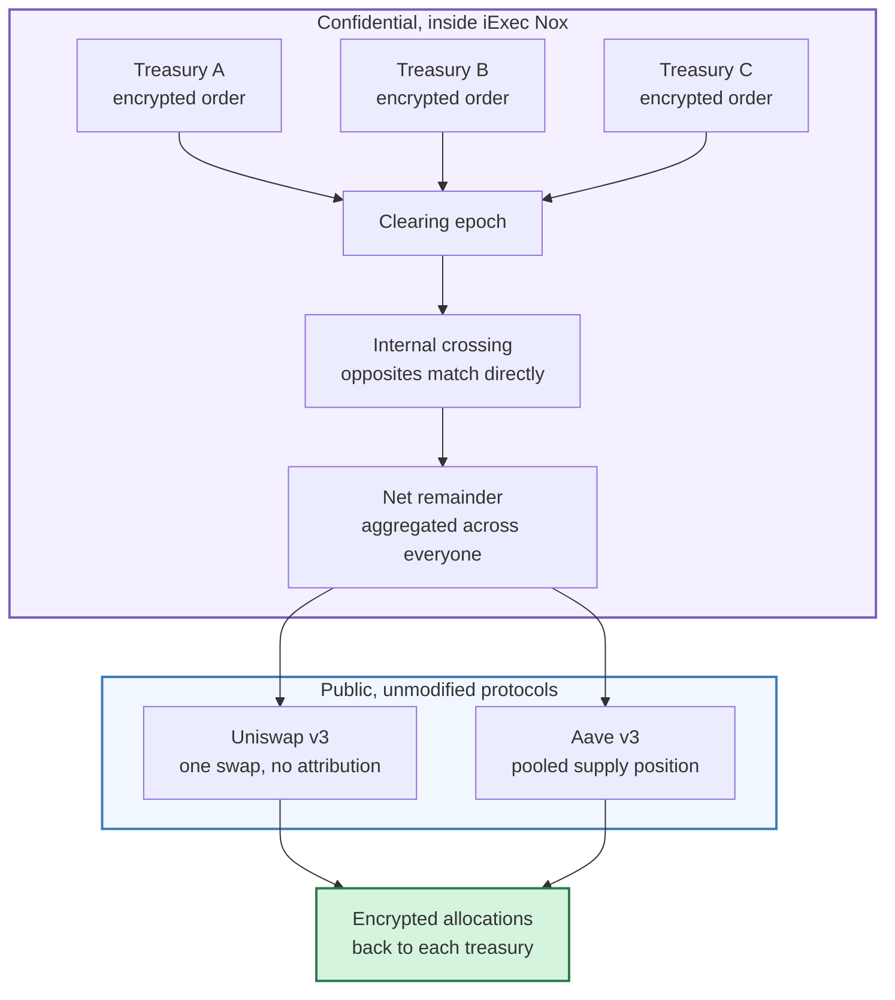
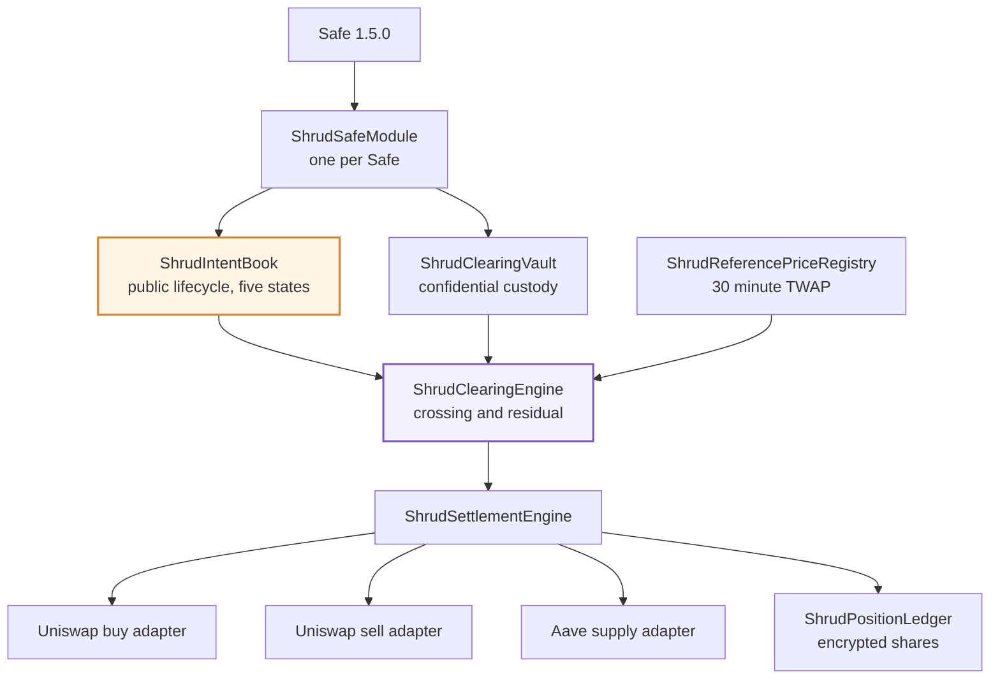

# shrud

**Confidential treasury clearing for Safe, Uniswap and Aave. Built on iExec Nox. Live on Ethereum
Sepolia.**

A DAO treasury that wants to move two million dollars from USDC into ETH has a problem that has
nothing to do with execution quality. The moment the order is public, so is the strategy. Size,
direction, and the wallet behind it are all readable before the trade fills, and the treasury pays
for being visible.

shrud is a clearing layer that sits on top of protocols that are public by design and **modifies none
of them**. Treasuries submit encrypted orders. Matching opposites cross privately at a reference
price. Only the unmatched remainder reaches a public venue, aggregated across every participant, and
only when enough of them contributed for the aggregate to hide its parts.

---

## How it works



**Three properties make this work:**

**Crossed volume never reaches a public venue.** If one treasury is buying ETH and another is
selling it, they match inside the encrypted computation. There is no public order to front run
because no public order exists.

**The remainder is aggregated and unattributed.** One transaction carries everybody's leftover. An
observer sees a net flow with no way to decompose it.

**Nothing is published unless enough participants contributed.** An aggregate from a single treasury
is that treasury's order in plain sight. shrud holds it back and rolls it into the next epoch.

---

## What is public and what is not

This distinction is the whole product, so it is stated precisely.

| Public | Confidential |
|---|---|
| That a Safe submitted an order | Which side it is on |
| The trading pair, for example USDC and ETH | The amount |
| The expiry | The private limit price |
| The epoch it joined | Whether it crossed, partially crossed, or held |
| The final aggregate that reached Uniswap | Each treasury's contribution to it |
| That an epoch settled | Every individual allocation |

The public order lifecycle has **exactly five states**, and `Processed` is where every order that
entered a sealed epoch ends up. The one that filled completely, the one that failed its limit, and
the one that was underfunded are indistinguishable from outside. This is asserted by a test rather
than claimed in prose.

---

## Live on Sepolia

Seventeen contracts, deployed and verifiable. **Nothing is seeded**: no demo Safes, no planted
balances, no fabricated epochs.

| Contract | Address |
|---|---|
| ShrudIntentBook | [`0xbcfc7e6b8854683d996efa6f097fb28d86f8a2f9`](https://sepolia.etherscan.io/address/0xbcfc7e6b8854683d996efa6f097fb28d86f8a2f9) |
| ShrudClearingEngine | [`0xfa593b0f5e6c4c470ffc0b0ba2b71c22796799fa`](https://sepolia.etherscan.io/address/0xfa593b0f5e6c4c470ffc0b0ba2b71c22796799fa) |
| ShrudSettlementEngine | [`0xa0b296f3375671c90e0774146545e3c2ac26a6a1`](https://sepolia.etherscan.io/address/0xa0b296f3375671c90e0774146545e3c2ac26a6a1) |
| ShrudModuleFactory | [`0x9b41996562eb37dfc6b1f004b93e68abaa5477f8`](https://sepolia.etherscan.io/address/0x9b41996562eb37dfc6b1f004b93e68abaa5477f8) |
| ShrudClearingVault | [`0x2bee6aa4547150cde9f83dcc181dc90afbc0a02e`](https://sepolia.etherscan.io/address/0x2bee6aa4547150cde9f83dcc181dc90afbc0a02e) |

**All 17 have verified source on Etherscan.** Full set with runtime code hashes and constructor
arguments in [`deployments/11155111.json`](deployments/11155111.json).

---

## Verify it yourself

Nothing in this repository asks to be believed. The verifier reads the chain and re-derives every
claim.

```bash
pnpm install
pnpm compile
pnpm verify:live
```

**Read-only.** It needs no private key, which means you can run it against this deployment without
asking anyone for anything.

It checks runtime code hashes against the manifest, that the wiring is closed and the deployer cannot
forge intents, the governance delays actually enforced, registered assets and price routes, adapter
manifests and their zero slippage tolerance, the privacy floors, and that nothing has been seeded.

Expected output ends with **`65 checks passed, 0 failed.`**

---

## Getting started

```bash
git clone https://github.com/YOUR_USERNAME/shrud.git
cd shrud
pnpm install
cp .env.example .env      # then fill in the values
pnpm compile
pnpm test
```

**Requirements:** Node 22 or newer, pnpm 10 or newer, [Foundry](https://getfoundry.sh), and Docker
Desktop for the Nox integration tests.

### Environment

| Variable | Needed for | Notes |
|---|---|---|
| `ALCHEMY_API_URL` + `ALCHEMY_API_KEY` | Everything touching Sepolia | Split so the base URL can be logged while the key never is |
| `ETHERSCAN_API_KEY` | Source verification | |
| `DEPLOYER_PRIVATE_KEY` | Deploying only | Must hold nothing but gas |
| `DEPLOY_SEPOLIA` | Deploying only | Must be exactly `true`, as a separate opt-in from running the command |
| `LOCAL_RPC_URL` | Local node work | Optional, defaults to `http://127.0.0.1:8545` |
| `NEXT_PUBLIC_REOWN_PROJECT_ID` | The web application | Free, from [dashboard.reown.com](https://dashboard.reown.com) |

shrud **refuses keyless public RPC endpoints**. `eth_getLogs` behaviour differs silently between
them, so a partial history would look like a complete one.

---

## Testing

Four independent layers, because each one catches what the others cannot.

```bash
pnpm test                                                  # 51 unit and fuzz
FOUNDRY_PROFILE=fork forge test --fork-url "$RPC"          # 19 against live Sepolia protocols
npx hardhat test                                           # 77, including 7 against real Nox
pnpm test:packages          # 14 clearing mathematics
pnpm verify:live                                           # 65 against the live deployment
```

The Nox suite runs against a real gateway in Docker and confirms the four behaviours this design
depends on:

| Behaviour | Consequence for the design |
|---|---|
| No boolean algebra for `ebool` | Every gate is arithmetised through `select` and `mul` |
| `safeSub` returns encrypted zero rather than reverting | An underflow does not publish the comparison it was hiding |
| Identical computations produce identical handles | Every handle crossing a trust boundary must be isolated first |
| An input proof is accepted twice | Replay protection has to be built, not assumed |

---

## Architecture



**Three adapters rather than one.** Each adapter's tokens, venue and recipient are constructor
immutables, so a net buy, a net sell and a pooled supply need three separate contracts. An adapter
that took its direction from the caller would be a general purpose call from a vault holding pooled
treasury funds.

---

## Documentation

| Document | Contents |
|---|---|
| [SUBMISSION.md](SUBMISSION.md) | Hackathon submission pack |
| [NOTICE.md](NOTICE.md) | Every open-source project this builds on, and what is vendored |
| [docs/DESIGN-METHOD.md](docs/DESIGN-METHOD.md) | How the interface was built from the design spec |
| [SECURITY.md](SECURITY.md) | The privacy boundary, trust assumptions, and how to report a vulnerability |
| [feedback.md](feedback.md) | Findings about the iExec Nox tooling, required by the hackathon brief |
| [docs/AUDIT.md](docs/AUDIT.md) | Pre-deployment self-audit, including two real gaps found and closed |
| [docs/demo-script.md](docs/demo-script.md) | A three minute demo script with timings |
| [shrud-production-prd-v1.1.md](shrud-production-prd-v1.1.md) | The full product requirements this was built against |

---

## Built for the iExec WTF Hackathon

The brief asked for a real open-source protocol enhanced with privacy, rather than a proof of
concept. shrud integrates with **Safe**, **Uniswap v3** and **Aave v3** without modifying any of
them, and adds confidentiality through iExec Nox at the clearing layer.

Everything in this repository was written during the hackathon. No previous project was reused. The
external addresses in [`source-lock.json`](source-lock.json) were each code-verified on Sepolia
rather than copied from a documentation page.

---

## What this does not do

Stated here because a README that omits limitations is marketing.

- **It has not been audited.** Do not use it on a network holding real value.
- **A full clearing epoch has not run end to end on Sepolia.** Every stage is tested in isolation and
  against the real Nox stack. The composition needs three funded Safes, which by design this
  deployment does not create for you.
- **It cannot hide timing.** Submission times are public. Submitting alone, immediately before a
  seal, is identifying whatever the protocol encrypts.
- **It cannot help a Safe with one owner.** The privacy floor counts participants, not signatures.
- **It depends on the iExec TEE.** A broken TEE reveals everything. This is a real assumption and
  [SECURITY.md](SECURITY.md) states it plainly alongside the others.

---

## License

**GPL-3.0-or-later.** See [LICENSE](LICENSE).

One file is vendored from open source: `contracts/libraries/uniswap/TickMath.sol`, from Uniswap
v3-core 1.0.1 under GPL-2.0-or-later, with its licence header intact and its provenance recorded in
the file. Full third-party attribution is in [NOTICE.md](NOTICE.md).

Safe, Uniswap v3, Aave v3 and iExec Nox are integrated as deployed and unmodified. No protocol was
forked.
