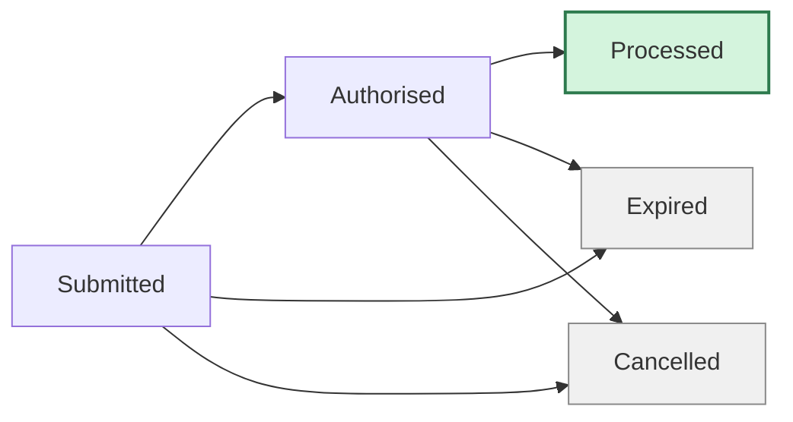
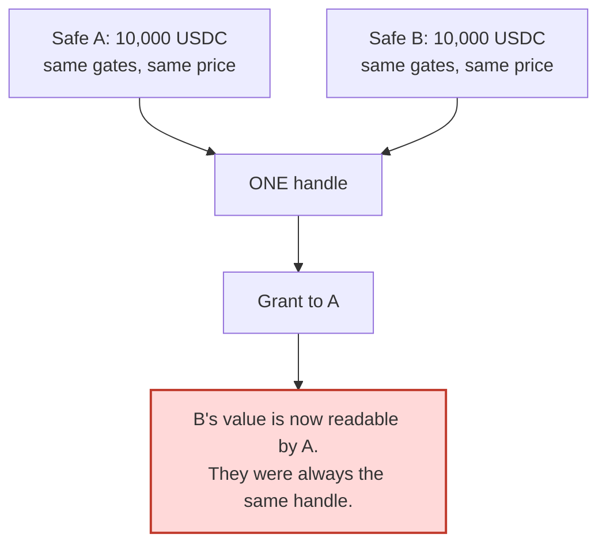

# Security policy

shrud moves value between treasuries at prices nobody outside can observe. A bug here does not throw
an error. It transfers the wrong amount, from a Safe that cannot tell, to a Safe that cannot tell
either. Please read this page before reporting, and before trusting anything here with value.

---

## Status

**This software has not been audited. It is deployed on Ethereum Sepolia only. Do not use it on a
network holding real value.**

Written for the iExec WTF Hackathon. Every claim in this repository is checkable with
`pnpm verify:live`, which reads the chain and re-derives each one rather than asserting it.

---

## Reporting a vulnerability

Open a **private security advisory** through GitHub on this repository, under **Security** then
**Report a vulnerability**. That keeps the report between you and the maintainers until a fix exists.

Please do not open a public issue for anything that affects funds, privacy, or access control.

Include what you have:

- What the bug is, and which contract or script
- How to reproduce it, ideally as a failing test
- What an attacker gains
- The commit hash you tested against

We aim to acknowledge within 72 hours. There is no bug bounty. This is a hackathon project and we
would rather say that plainly than imply a program that does not exist.

---

## What we consider in scope

| Area | Examples |
|---|---|
| **Privacy** | Anything that reveals an order's side, size, limit, or outcome from public data. Anything that distinguishes a successful order from a failed one. |
| **Access control** | Any path that lets an account write intents for a Safe it does not own, or read a handle it was not granted. |
| **Value** | Any path that moves more than a treasury authorised, settles below a private limit, or strands funds with no recovery. |
| **Governance** | Any way to bypass the registration timelock, register an unreviewed adapter, or change a wired address. |
| **Price** | Any way to move the reference price within one epoch, or settle against a stale snapshot. |

## What is out of scope

- Anything requiring a compromised Safe owner key
- Anything requiring the Nox TEE itself to be broken
- Gas inefficiency without a correctness or availability consequence
- Findings against Sepolia testnet tokens or their faucets
- Third-party contracts we integrate with rather than ship: Safe, Uniswap v3, Aave v3, iExec Nox

---

## The privacy boundary

The public state machine has **exactly five members** and gaining a sixth would be a vulnerability.



**`Processed` is where every order that entered a sealed epoch ends up.** The one that crossed fully,
the one that crossed partially, the one whose private limit failed, the one that was underfunded, the
one deferred by the privacy floor, and the one that simply held. From outside they are
indistinguishable.

States that must never exist, because each is a free oracle:

| Forbidden state | What it would leak |
|---|---|
| `Rejected` | That something went wrong, and roughly what |
| `InsufficientBalance` | Turns repeated oversized orders into a binary search over a confidential balance |
| `Buy` / `Sell` | Exactly what the product exists to hide |
| `Crossed` | Which orders found counterparties |
| `LimitFailed` | The relationship between a private limit and a public price |
| `Excluded` | Who did not make the cut, which with a small set identifies who did |

A pull request adding any of these should be rejected on sight.

---

## Privacy floors

An aggregate is published only when enough independent participants contributed to it. A single
contributor's aggregate is that contributor's amount in plaintext with a privacy story attached.

| Floor | Value | What it gates |
|---|---|---|
| **Epoch floor** | `k = 3` | Whether the epoch may publish anything at all |
| **Residual floor** | `k = 2` | Whether the unmatched swap imbalance may reach a public venue |
| **Supply floor** | `k = 2` | Whether the aggregate supply may reach the pooled position |

The residual route and the supply route carry **separate** floors. Sharing one would let a
two-contributor swap authorise a one-contributor supply.

`pnpm verify:live` asserts all three are at least 2 against the deployed contracts, which is the
check that would catch a floor lowered for testing and never raised back.

---

## Handle isolation

The most consequential property in this codebase, and the least obvious.

Nox derives a handle as a pure function of the operator and its operands whenever any operand is
confidential. Two logically different encrypted quantities computed identically from identical
operands are **the same handle sharing one permanent access list**. There is no way to revoke a
grant.



The rule this codebase follows:

> **Never grant a Safe, a viewer, or the public a handle that something else could equal.**

Intermediates collide freely and harmlessly because nobody is ever granted one. Every handle that
crosses a boundary is isolated under a domain hash first. See
`contracts/base/ShrudHandleIsolation.sol`.

---

## Decryption proofs

`validateDecryptionProof` is a pure EIP-712 signature check. No access list, no nonce, no expiry, no
caller binding. A valid proof attests that the gateway decrypted **some** handle to **some** value.

It becomes a statement about a specific epoch only when the handle is checked against a commitment
recorded earlier. shrud commits the exact handles an epoch will publish at seal time and refuses any
proof for a handle outside that set.

A contract that accepts a proof without that check has a replay hole which will not appear in testing,
because in testing the proof is always for the right handle.

---

## Trust assumptions

Stated plainly, because a security page that omits them is marketing.

| You must trust | Why |
|---|---|
| **The iExec Nox TEE** | It computes on plaintext inside the enclave. A broken TEE reveals everything. |
| **The Nox gateway** | It performs decryptions. It cannot forge a proof, but it can decline to serve one. |
| **Your Safe's owners** | The threshold is your security. shrud adds no protection against your own signers. |
| **Uniswap v3 and Aave v3** | Residuals and pooled supply settle through them. shrud checks their code hashes on every use and cannot make them correct. |
| **The reference price** | A 30-minute TWAP with a tick deviation bound. Manipulating it costs sustained price impact across that window, which is a cost rather than an impossibility. |

## What shrud does not protect against

- **Timing analysis.** Submission times are public. Submitting alone, immediately before a seal, is
  identifying regardless of what the protocol hides.
- **A Safe with one owner.** The privacy floor counts participants, not signatures.
- **Off-chain correlation.** If you announce your trade, the protocol cannot unannounce it.
- **A compromised owner key.** Nothing here helps.

---

## Governance

Every registry change is queued publicly and cannot be applied until a delay elapses. The delay is
the window in which a treasury that disagrees can withdraw.

- **Chain id 1 enforces seven days on chain.** A mainnet deployment cannot choose less, whatever its
  deploy script says.
- The Sepolia deployment uses **ten minutes**, recorded in `deployments/11155111.json` and readable
  from each registry.
- **Disabling is immediate.** Stopping a venue that has gone wrong must never wait for a timer.
- `applyRegistration` is **permissionless**. The governor decides what is queued and whether it is
  cancelled, never whether a publicly reviewed change eventually lands.

---

## Verifying a deployment yourself

```bash
pnpm install
pnpm compile
pnpm verify:live
```

Read-only. Needs no private key, so it runs against a deployment you do not control. It checks
runtime code hashes, closed wiring, governance delays, registered assets and routes, adapter
manifests, privacy floors, and that nothing has been seeded.

The last one is deliberate. This deployment contains **no demo data**, and the verifier asserts the
absence rather than the presence.

---

## Related documents

| Document | Contents |
|---|---|
| [docs/AUDIT.md](docs/AUDIT.md) | Pre-deployment self-audit, including two gaps found and closed |
| [feedback.md](feedback.md) | Findings about the iExec Nox tooling itself |
| [README.md](README.md) | What shrud is and how to run it |
