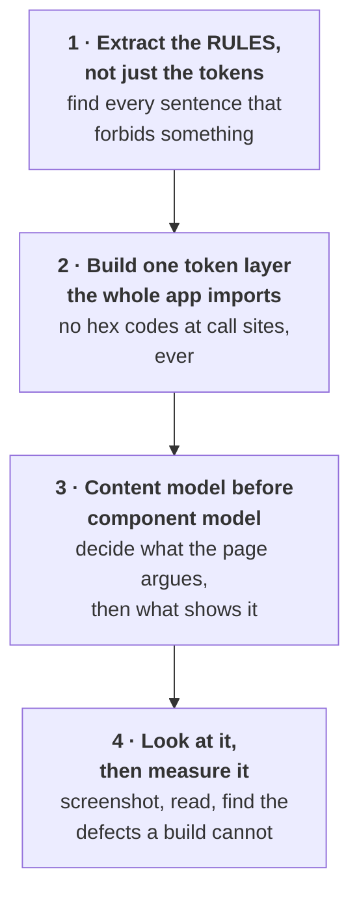
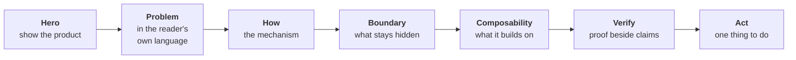

# Building a UI from a design spec

How the shrud interface was built from its design specification, written so it can be handed to
another agent as instructions. Nothing here is specific to shrud's visual language. The method is the
transferable part.

The spec itself is not shipped in this package, so the examples below quote the rules that mattered
rather than referring you to a file you do not have.

---

## The short version

Most agents read a design spec, extract the hex codes, and then write components that use those hex
codes. The result is a page that is technically on-palette and still looks like a template, because
**the spec's colours were never the thing that mattered.** What mattered were its rules.

The method below has four moves:



---

## 1 · Extract the rules, not just the tokens

Every good design spec has two kinds of content. Agents reliably use the first and ignore the second.

**Tokens** are colours, sizes, radii. Easy to extract, easy to apply, and they get you maybe 30% of
the way. They are why the output is on-brand and still generic.

**Rules** are the sentences that say what NOT to do. They are where the spec's personality actually
lives, and they are usually in a section called "Do's and Don'ts" that agents skim.

From shrud's `design.md`, the rules that shaped everything:

| Rule from the spec | What it forced |
|---|---|
| "Do not use flat drop shadows on cards; depth must come from inset white highlights" | Every card in the app has **zero** outer shadow. One inset variable carries all elevation. |
| "Do not use thin 1px borders for separation; prefer surface shifts or 48px+ whitespace" | The `Card` component has no `border` prop at all. Separation is `tone="cloud"` versus `tone="canvas"`. |
| "Do not introduce a new accent colour outside the tangerine/pink/coral/sky system" | The `Pill` component has a **closed** tone vocabulary of five. Adding a sixth requires editing the primitive. |
| "Do not stack more than two filled CTAs in a row" | Exactly two buttons in every CTA cluster, everywhere. |
| "40-50px pill radius on all interactive elements, 32px on cards" | Even the focus ring is radiused, because a square outline on a pillowy system reads as a bug. |

**Tell your agent this explicitly:**

> Read the "Do's and Don'ts" section first and treat every "Do not" as a constraint you must
> architect around, not a preference you apply. For each one, name the component that makes it
> impossible to violate. If a rule can only be followed by remembering it at each call site, you have
> not implemented it.

That last sentence is the whole trick. A rule enforced by discipline gets broken on page nine. A rule
enforced by a component that has no prop for the wrong thing cannot get broken.

---

## 2 · One token layer, imported everywhere

There is exactly one file in shrud's web app that contains a hex code: `src/app/globals.css`. Every
other file references a token.

This is not tidiness. It is what makes the spec **checkable**. If a reviewer asks "does this follow
the design system", the answer is one file long. If hex codes are scattered across forty components,
nobody can answer that question and drift is invisible.

The layer has three parts:

**Raw tokens**, straight from the spec.

```css
--color-tangerine: #ff8a00;
--radius-card: 32px;
```

**Semantic tokens**, which the spec does not give you and which you must invent from the product.

```css
--color-confidential: #7c5cbf;   /* an encrypted value */
--color-public: #3d7ab8;         /* a published value */
--color-settled: #2d7a4d;        /* a completed epoch */
```

This is the step most agents skip. Raw tokens tell you what colours exist. Semantic tokens tell you
**what they mean in this product**, and they are what stop a developer from picking purple because it
looked nice. In shrud, `--color-confidential` is used in eleven places and every one of them means
the same thing: the user is looking at something encrypted.

**Composed classes** for shapes that repeat.

```css
.surface-glass { background: var(--color-cloud); border-radius: var(--radius-card);
                 box-shadow: var(--inset-glass); }
```

**Tell your agent:**

> Create the token layer before writing any component. Include semantic tokens derived from the
> product's own vocabulary, not just the raw palette. After that, no file may contain a raw colour
> value. If you need a colour that has no token, the answer is a new token with a name that says what
> it means, not a hex code inline.

---

## 3 · Content model before component model

This is the largest difference and the hardest to convey, because it does not look like a design
step.

Before writing a single component, decide **what each page argues and in what order**. Then build the
components that argument needs. Doing it the other way round produces a page assembled from a
component library, which is exactly what "AI slop" looks like: three equal cards, a feature grid, a
generic testimonial band, and no reason for any of it.

shrud's landing page is seven sections in a fixed order:



A reader who stops at any point has been told something complete. That property is a content
decision, and no component library produces it.

**Two specific tactics that carried most of the weight:**

**Put the product in the hero.** shrud's hero contains a rendered order ledger showing three rows
where the Side column reads "Encrypted". That single element makes the argument the next 2,000 words
explain. A reader who sees nothing but a headline and two buttons has to be persuaded by prose;
a reader who sees the thing already understands.

**Give every screen a "why" note.** Every dashboard route in shrud ends with a short block explaining
why that screen works the way it does. Not what the button does. Why the mechanism is shaped that
way. It is what turns an interface into something a judge can evaluate without reading the contracts.

**Tell your agent:**

> Before building any page, write out the sections in order and state the argument each one makes.
> Then justify the order. Reject any layout of three equal cards unless the three things genuinely
> are peers. Put the actual product surface in the hero rather than describing it. On every screen
> that involves a non-obvious mechanism, add one short block explaining why it works that way.

---

## 4 · Look at it, then measure it

A UI that compiles is not a UI that works. Everything below was found by looking at shrud after it
built cleanly.

**Screenshot it and actually read the image.** Not "does it render" but "read every number on this
page and check it". Doing this on shrud's dashboard surfaced that the app said **14 contracts** while
the docs said 17, because the manifest keeps core contracts and adapters in separate objects. That is
a credibility defect a reviewer would catch in ten seconds, and no test would ever fail on it.

**Measure the things a screenshot hides.** Two automated checks caught real defects:

```js
// Horizontal overflow. Invisible in a screenshot, immediately obvious to a phone user.
const overflow = document.documentElement.scrollWidth - document.documentElement.clientWidth;

// Text below the design system's minimum size.
[...document.querySelectorAll("p,span,a,li,button")]
  .filter(el => el.textContent?.trim() && parseFloat(getComputedStyle(el).fontSize) < 11.5).length;
```

The first found a 44px overflow on mobile, caused by a CSS grid child defaulting to
`min-width: auto`, so a code block refused to shrink and pushed the whole page sideways. The
`overflow-x-auto` on the block could not help while its column was still sized to its content. That
class of bug is invisible in every screenshot and to every type checker.

**Run it at three widths, on every route.** 390, 768, 1440. Ten routes, three widths, one assertion.
It takes a minute and it is the difference between "responsive" as a claim and as a fact.

**Tell your agent:**

> After the build passes, screenshot every significant page and read the rendered output for factual
> errors, not just visual ones. Then run an automated check for horizontal overflow and undersized
> text at 390px, 768px and 1440px across every route. Report what you found rather than asserting it
> looks fine.

---

## The prompt

Everything above, compressed into something you can paste:

> Build the UI from `design.md`. Follow this method:
>
> **1.** Read the spec's "Do's and Don'ts" first. Treat every "Do not" as an architectural
> constraint. For each one, name the component that makes violating it impossible. A rule that can
> only be followed by remembering it at each call site is not implemented.
>
> **2.** Build one token layer before any component. Include semantic tokens named after the
> product's own concepts, not just the raw palette. After that, no other file may contain a raw
> colour value.
>
> **3.** Before building any page, write its sections in order and state the argument each one makes.
> Justify the order. Reject three-equal-cards layouts unless the three things are genuinely peers.
> Put the real product surface in the hero rather than describing it. Add a short "why this works
> this way" block to every screen with a non-obvious mechanism.
>
> **4.** Build every route the product needs, including the unglamorous ones. Empty states are the
> common case in a new deployment, so write them as real content that says what would fill them, with
> a link to the thing that does.
>
> **5.** After the build passes: screenshot every page and read the output for factual errors. Run an
> automated horizontal-overflow and font-size check at 390px, 768px and 1440px on every route. Report
> what you found.
>
> Never ship placeholder or mock data. If a value is not available, say so in the interface.

---

## What made the biggest difference, ranked

1. **Rules over tokens.** The "no drop shadows, depth from inset highlights" rule is why the app
   does not look like every other rounded SaaS product using the same palette.
2. **Content model first.** Seven sections that argue in order, rather than a component gallery.
3. **The product in the hero.** One rendered surface replaced several paragraphs.
4. **Every route built.** Twelve dashboard routes with honest empty states reads as a product. Three
   routes and a "coming soon" reads as a demo.
5. **Looking at the screenshots.** Two real defects, neither catchable by a compiler.
