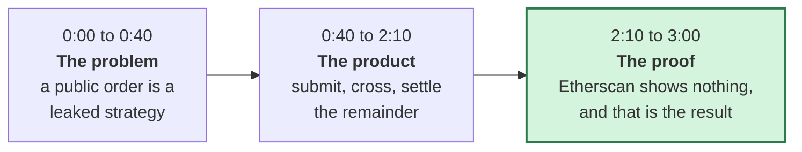

# Demo script

**Target length: three minutes.** The hackathon allows four. Three gets watched to the end.

Record at 1920x1080. Speak at a normal pace. Do not read this word for word, but do hit every beat,
because the ordering builds an argument rather than listing features.

---

## Before you record

| Check | Why |
|---|---|
| Browser zoom at 110 percent | Text has to be legible in a compressed video |
| One clean browser window, no bookmarks bar, no other tabs | Every extra pixel competes with the point |
| Wallet already on Sepolia with gas | Nobody wants to watch a network switch |
| Safe already created, module already installed | Setup is not the story |
| Test USDC already wrapped | Same reason |
| Etherscan tab pre-opened on your intent book address | You will switch to it at 2:10 |
| Notifications off | Obvious and always forgotten |

**Have this ready to paste**, so no typing appears on camera:

- Your Vercel URL
- Your Safe address
- Your intent book address on Sepolia Etherscan

---

## The three beats



---

## 0:00 to 0:40 · The problem

**On screen:** the shrud landing page.

> "A DAO treasury wants to move two million dollars from USDC into ETH.
>
> The moment that order hits Uniswap, everyone can see it. The size, the direction, the wallet. Front
> runners price against it, and by the time it fills, the treasury has paid for the privilege of being
> visible.
>
> This is not a Uniswap problem. Public order flow is what makes these protocols work. It just means
> that any treasury large enough to matter cannot use them without leaking its strategy."

**Scroll slowly to the section showing the three-phase flow.**

> "shrud is a confidential clearing layer that sits on top of Safe, Uniswap and Aave. It modifies
> none of them. It is built on iExec Nox, which lets smart contracts compute on encrypted data inside
> a trusted execution environment."

---

## 0:40 to 2:10 · The product

**Click through to the dashboard.**

> "Here is a treasury. It is a standard Safe with a shrud module installed. The balance you see is
> confidential, held as a wrapped confidential token, and it is decryptable only by this Safe's
> owners."

**Open the order form. Fill it in while talking.**

> "I want to buy ETH with fifty thousand USDC, and I will not pay above a limit I am setting here.
>
> The amount, the direction and the limit are all encrypted in the browser before anything is sent.
> The chain never sees any of them."

**Submit. Wait for confirmation.**

> "That is submitted. Notice what the interface tells me and what it does not."

**Point at the order row.**

> "Status: Submitted. Pair: USDC and ETH. Expiry. That is the entire public record.
>
> Not which side I am on. Not how much. Not my limit."

**Move to the clearing view.**

> "Every thirty minutes an epoch seals. shrud takes every order in that window and matches opposites
> against each other first, entirely inside the encrypted computation, at a thirty minute
> time-weighted price from the Uniswap pool.
>
> If I am buying ETH and another treasury is selling it, we cross directly. That volume never reaches
> a public venue at all. There is nothing to front run because there is no public order."

**Point at the residual.**

> "Only what does not match gets aggregated into one net remainder and sent to Uniswap. One
> transaction, everybody's leftover combined, no individual attribution.
>
> And it only goes out at all if enough treasuries contributed. If only one did, that transaction
> would be that treasury's order in plain sight, so shrud holds it back and rolls it forward."

**Show the outcome on the order.**

> "My result comes back encrypted. I can decrypt it because I am an owner of this Safe. Nobody else
> can, including the people I just crossed with."

---

## 2:10 to 3:00 · The proof

**Switch to the Etherscan tab. Open the submission transaction.**

> "This is the same transaction on Etherscan. This is what everyone else sees.
>
> A submission event. An address. A pair. An expiry. Every value that matters is a Nox handle, which
> is a pointer to encrypted data, and it decrypts only for the Safe that owns it."

**Scroll to the logs.**

> "There is no side here. No amount. No limit. No outcome.
>
> An order that filled completely and an order that was underfunded produce byte-identical public
> traces. Same status, same events, same ordering. That is asserted by a test in this repository,
> because a privacy claim that is not tested is a hope."

**Switch to a terminal. Run the verifier.**

```bash
pnpm verify:live
```

> "Everything I have claimed is checkable. This reads Sepolia and re-derives each one. Sixty-five
> checks. It needs no private key, so you can run it against my deployment without asking me for
> anything.
>
> The last section checks that nothing has been seeded. No demo Safes, no planted balances, no fake
> epochs. What you have seen is the real deployment doing real work."

**Back to the landing page for the closing line.**

> "Seventeen contracts on Sepolia. Safe, Uniswap and Aave, all unmodified. Confidentiality from iExec
> Nox.
>
> shrud. Everything is on GitHub."

---

## Words to avoid

| Do not say | Say instead |
|---|---|
| "Fully private" | "Confidential", and name what is public |
| "Impossible to see" | "Not published", which is what is true |
| "Zero knowledge" | It is a TEE. Different technology, do not borrow the term |
| "Trustless" | It has trust assumptions. `SECURITY.md` lists them |
| "Revolutionary" | Show the Etherscan page instead |

A judge who catches one overstatement discounts everything else. The Etherscan moment is the strongest
thing in this demo, and it only lands if everything before it was accurate.

---

## If something breaks on camera

Keep going and narrate it.

> "That transaction is still confirming. Sepolia has slow blocks sometimes. Here is one I submitted
> earlier."

Have a completed order from a previous session ready to switch to. A recovered mistake reads as
competence. A restarted recording reads as staged.

---

## Timing checkpoints

| Time | You should be |
|---|---|
| 0:40 | Leaving the landing page |
| 1:10 | Submitting the order |
| 1:40 | Explaining internal crossing |
| 2:10 | On Etherscan |
| 2:40 | Running `verify:live` |
| 3:00 | Done |

If you are past 2:30 and not yet on Etherscan, cut the Aave section. The Etherscan moment is the one
thing that cannot be cut.

---

## Uploading

YouTube unlisted, or a direct file. Do not put it behind a login. Judges will not create an account
to watch it.

Title it plainly:

> shrud: confidential treasury clearing on Safe, Uniswap and Aave, built with iExec Nox

In the description, put the GitHub link, the live Vercel URL, and the Sepolia address of the intent
book. Someone will check.
