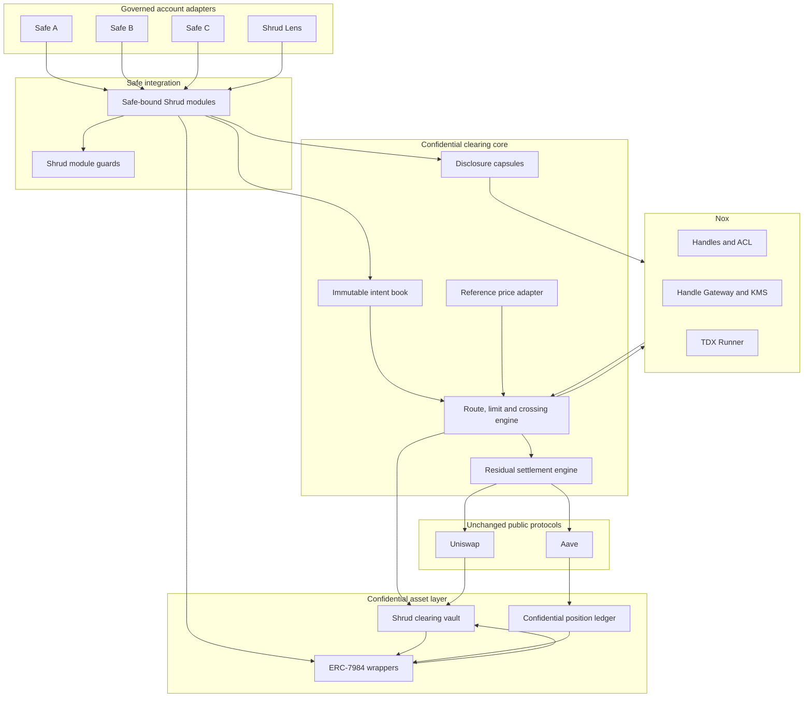

# shrud

## Production Product Requirements Document

**Version:** 1.1  
**Status:** Build specification  
**Launch network:** Ethereum Sepolia  
**Primary account adapter:** Safe Smart Account  
**Confidential compute:** iExec Nox  
**Public settlement adapters:** Uniswap and Aave  
**Brand pronunciation:** “shroud”  
**Tagline:** Hide the order. Settle the net.  
**Revision focus:** Confidential multi-treasury net clearing, internal crossing, and residual settlement  

---

## 1. Product decision

### 1.1 Name

The product is **shrud**.

The name compresses “shroud” into five letters. It follows the same sharp, vowel-stripped naming language as nulth and untch while matching the product’s promise: individual treasury orders are covered, while the minimum public settlement remains visible and verifiable.

Use the brand in lowercase in prose and interface chrome. Use `SHRUD` only for compact marks, contract prefixes, repository headings, and terminal output.

### 1.2 One-line definition

Shrud is a confidential treasury clearing network that crosses encrypted DeFi orders from multiple Safe treasuries and reveals only the net transactions required by unchanged public protocols.

### 1.3 Thirty-second pitch

Treasury order flow becomes public before execution. Amounts, direction, limits, route choice, urgency, and resulting positions can be mapped back to the organisation that submitted them. Shrud lets multiple Safe treasuries submit governed encrypted orders. Nox privately validates balances and limits, matches compatible opposing flow, groups the remaining route demand, and exposes only the residual settlement required by Uniswap or Aave. Each treasury’s order, internal match, exclusion result, contribution, and final ownership stay confidential.

### 1.4 Product category

Shrud is a **confidential treasury clearing network**. Safe is the first account adapter, not the product category. Uniswap and Aave are unchanged settlement venues, not forked dependencies.

The launch product consists of:

- **Shrud Core**, the Safe adapter, confidential asset layer, immutable order intents, epoch lifecycle, and settlement contracts.
- **Shrud Clear**, the Nox-powered route classifier, private limit engine, opposing-flow crossing engine, privacy-floor logic, and residual calculator.
- **Shrud Lens**, a local intent verifier that decrypts an order for an authorised Safe owner, recomputes its commitment, and blocks signing when the visible order differs from the encrypted on-chain intent.
- **Shrud Guard**, the module guard and fixed execution boundary around every Safe-triggered action.
- **Shrud Pools**, pooled public DeFi positions with confidential treasury ownership accounting.
- **Shrud Capsules**, frozen selective-disclosure reports with scoped Nox viewer access.
- **Shrud Verify**, the web and command-line proof suite for Safe authority, Nox computation, internal crossing, residual settlement, allocations, and privacy guarantees.

Product terminology:

- The interface calls a governed encrypted economic instruction an **order**.
- Contracts may use `Intent` where an immutable signed instruction is the more precise technical term.
- A **clearing epoch** is the set of candidate orders considered together.
- An **internal cross** is value exchanged between compatible confidential balances without touching a public liquidity venue.
- A **residual settlement** is the net unmatched amount sent to a public protocol.

---

## 2. Strategic thesis

### 2.1 The market failure

Safe gives organisations strong threshold authorisation, but authorised treasury orders still broadcast commercially useful information:

- exact assets and balances
- buy or sell direction
- order size
- minimum return or maximum price
- selected protocol and route
- urgency and expiry
- the organisation’s resulting DeFi position
- repeated behaviour that reveals treasury policy, runway, and future allocation plans

This data benefits MEV searchers, counterparties, competitors, hostile governance participants, copy traders, extortion attempts, and anyone profiling an organisation’s finances.

The missing primitive is a shared confidential clearing layer. Treasuries need to govern their own orders while preventing every order from becoming a separate public transaction.

### 2.2 Why one encrypted router is insufficient

A transparent protocol needs plaintext at its execution boundary. Encrypting one treasury’s amount and then revealing the same amount to one Uniswap call creates a direct correlation between that treasury and the public trade.

Shrud separates individual order flow from venue settlement:

1. Treasuries maintain confidential ERC-7984 balances after shielding.
2. Safe owners submit encrypted amount, side, route, limit, expiry, and policy values.
3. Candidate orders enter one shared clearing epoch.
4. Nox privately validates, classifies, locks, and filters them.
5. Compatible opposing orders cross against one another at a registered public reference price.
6. Only the unmatched route-level residual becomes publicly decryptable.
7. Unmodified protocols receive ordinary plaintext calls for that residual.
8. Public outputs return to Shrud and are reconciled into encrypted treasury allocations.

The chain can prove that a public residual settled. It cannot map that residual back to any one treasury’s original order.

### 2.3 The decisive mechanism: confidential net clearing

For a USDC/WETH epoch, one group of treasuries may privately want to buy WETH while another privately wants to sell it. Shrud does not send both gross flows to Uniswap.

Nox computes:

- which orders are valid
- which side each order selected
- whether each private limit accepts the public epoch price
- each eligible buy demand and sell supply
- the maximum amount that can cross internally
- each treasury’s confidential internal allocation
- the remaining imbalance on one side
- the aggregate minimum output required for the residual public swap

Example:

```text
Encrypted treasury orders

Safe A: spend USDC to buy WETH       hidden
Safe B: sell WETH for USDC           hidden
Safe C: spend USDC to buy WETH       hidden
Safe D: allocate USDC to Aave        hidden

Nox private clearing

A and C demand partially cross B
only the unmatched USDC demand reaches Uniswap
D joins one aggregate Aave supply

Public settlement

one residual Uniswap transaction
one aggregate Aave transaction
```

The public sees net venue demand. It does not see the original sides, sizes, limits, internal match amount, excluded orders, or per-Safe settlement.

This adds economic value beyond concealment. Internal crossing can reduce public volume, slippage, MEV exposure, and unnecessary protocol fees.

### 2.4 Why Nox is load-bearing

Shrud uses Nox for calculations that decide custody, eligibility, matching, public exposure, and ownership:

- encrypted side and route classification
- private limit checks against a public reference price
- confidential balance locking with no public failure branch
- encrypted effective-participant and privacy-floor checks
- internal crossing without exposing gross demand or supply
- private residual-side and residual-size calculation
- encrypted-denominator pro-rata allocation
- confidential Aave ownership and withdrawal accounting

Nox safe arithmetic and confidential token operations keep invalid, underfunded, or excluded orders from becoming revert or event oracles. Failed private checks resolve to encrypted zero values or unchanged encrypted state while the public lifecycle remains uniform.

### 2.5 Competitive posture and occupied territory

Shrud must not present itself as a private multisig, vendor approval system, payout firewall, confidential committee vote, or destination-verification product. Those are separate products with a different threat model.

Shrud’s competitive statement is:

> Existing privacy stacks make encrypted applications possible. Shrud uses iExec Nox to turn governed orders from separate treasuries into one confidential clearing process, then settles only the public residual through unchanged DeFi.

The product should make a narrow, factual comparison with other privacy stacks. Nox and FHE systems have different trust and cryptographic models. Shrud’s defensible advantage is the complete clearing architecture, encrypted-by-encrypted arithmetic, no-revert confidential state transitions, Safe governance preservation, residual settlement, and executable verification.

---

## 3. Goals and non-goals

### 3.1 Product goals

1. Install into an existing Safe without forking or modifying Safe contracts.
2. Preserve each Safe’s current owners, threshold, and signature formats.
3. Accept governed encrypted orders from several independent treasuries.
4. Keep order side, amount, route, limit, balance, private eligibility, internal match, and allocation confidential.
5. Cross compatible opposing swap flow inside the confidential asset layer before using public liquidity.
6. Reveal only the net residual and minimum plaintext required by an unchanged public protocol.
7. Aggregate compatible Aave allocations into one public position while keeping treasury ownership shares encrypted.
8. Make Nox required for locking, classification, private limit enforcement, crossing, residual calculation, and allocation.
9. Maintain an explicit privacy and metadata boundary at every step.
10. Support independent verification through a live web verifier and one-command scripts.
11. Ship production-shaped infrastructure with guards, reference-price controls, recovery, monitoring, documentation, fuzzing, invariants, and adapter boundaries.
12. Allow new account and settlement adapters without changing the confidential clearing core.

### 3.2 Non-goals

1. Hiding the existence of a Safe, its public owners, or the owner who submits an encrypted input.
2. Hiding the initial public ERC-20 amount when an asset is wrapped.
3. Hiding the net residual from a public protocol that requires plaintext.
4. Making arbitrary dApp transactions private through a universal wallet interceptor.
5. Supporting arbitrary calldata, delegatecall, or user-selected adapter targets.
6. Building vendor registration, payout-address approval, reviewer voting, destination verification, or a treasury payment firewall.
7. Claiming that public recipient addresses remain secret after a public transfer.
8. Replacing Safe governance with a copied owner registry or a separate approval committee.
9. Granting auditors revocable access to live Nox handles. Shrud uses frozen disclosure handles and state rotation because access to an existing handle is persistent.
10. Treating Shrud Lens as custody, execution, or a private voting system.
11. Depending on a trusted coordinator or keeper for correctness or custody.
12. Claiming sender anonymity or hiding all transaction timing metadata.
13. Advertising internal crossing when the effective privacy floor or opposing liquidity requirement was not met.

---

## 4. Users and jobs

### 4.1 Treasury operator

A DAO operations lead, foundation finance team, protocol treasury manager, investment committee, market maker, or company treasury operator.

Jobs:

- shield assets held by a Safe
- create encrypted buy, sell, allocation, and withdrawal orders
- select private limits and expiry without leaking them publicly
- see confidential balances, crossed amounts, residual participation, and positions
- understand what will become public before settlement
- inspect clearing receipts and reconciliation
- create board, auditor, or counterparty disclosures
- recover safely if Shrud services are unavailable

### 4.2 Safe owner

An EOA or EIP-1271 contract owner responsible for reviewing and signing treasury orders.

Jobs:

- decrypt the exact order they are being asked to authorise
- verify amount, side, route, limit, expiry, and adapter identity
- confirm the plaintext recomputes the stored commitment
- sign through the Safe’s existing threshold model
- reject malformed, stale, unregistered, or mismatched orders
- distinguish what may cross internally from what may become a public residual

### 4.3 Auditor or board viewer

A party that needs scoped evidence without permanent access to the live treasury.

Jobs:

- receive one frozen disclosure capsule
- decrypt only the fields included in that capsule
- verify the capsule against source handles, clearing epochs, and public settlement receipts
- preserve a dated report without receiving future treasury access

### 4.4 Account adapter developer

A developer adding another governed account system after Safe.

Jobs:

- map the account’s current authority model into an immutable Shrud order commitment
- preserve the source account’s native signature checks
- pass order-submission, cancellation, recovery, and replay gates
- integrate without changing the confidential clearing contracts

### 4.5 Settlement adapter developer

A protocol integrator adding a public venue or position adapter.

Jobs:

- implement a narrow, fixed-target adapter interface
- declare assets, selectors, recipients, route templates, and reference-price rules
- pass fork, fuzz, invariant, bytecode, and reconciliation gates
- register without changing Safe modules or confidential ownership state

### 4.6 Public verifier

A judge, security researcher, investor, or ecosystem reviewer.

Jobs:

- confirm real Safe module installation and threshold authority
- confirm Nox handles, ACL, operations, and proofs
- trace the net Uniswap or aggregate Aave settlement
- verify that confidential claims reconcile with real reserves and public outputs
- see exactly what shrud hides and what it deliberately reveals

---

## 5. Product principles

### 5.1 Cross before routing

Compatible opposing flow is matched inside the confidential asset layer before any public swap. Public liquidity handles only the unmatched residual.

### 5.2 Public protocols are residual settlement boundaries

Uniswap, Aave, and future adapters receive only the minimum plaintext required to execute the net action. Individual order values remain encrypted before and after that boundary.

### 5.3 Fail closed without leaking

Private balance failure, limit failure, route exclusion, or privacy-floor failure becomes an encrypted zero contribution or unchanged encrypted state. Reverts are reserved for public invariants such as malformed proof, invalid Safe signatures, replay, stale public price, unregistered adapter, or broken reserve accounting.

### 5.4 Safe remains the authority

Shrud reads the Safe’s current owner and threshold state when an order is activated. It never treats a copied owner list as canonical and never adds a second approval committee.

### 5.5 Safe is an account adapter

Product architecture and copy must not collapse shrud into “a Safe privacy module.” Safe supplies governed orders. Shrud clears them. The clearing core can support another account adapter without changing its confidential mathematics.

### 5.6 A module is a privileged security boundary

Every executable target and selector is allowlisted. Delegatecall is forbidden. Output recipients are fixed. Module guard checks run before and after execution. The Safe retains a threshold-controlled disable and recovery path.

### 5.7 Privacy claims are visible in the interface

Every operation displays:

- what remains confidential
- what may cross internally
- what becomes public as residual settlement
- when public disclosure occurs
- who can decrypt each private value
- whether the epoch has a meaningful effective privacy set

### 5.8 Verification is a product surface

The verifier is part of the application. Every order, clearing epoch, position, capsule, and public settlement links to machine-readable evidence.

### 5.9 No fake universality

Shrud supports a finite registry of reviewed order families, price adapters, and settlement adapters. New routes are added through explicit code, fork tests, and policy review.

---

## 6. Privacy model

### 6.1 Data classification

#### Public from the start

- Safe address
- Safe owner addresses and threshold
- Shrud module and guard installation
- underlying ERC-20 used for shielding
- public wrap amount and transaction
- order commitment
- clearing epoch and broad asset family
- timestamps, gas usage, and event ordering
- registered order families, reference-price adapters, and settlement adapters

#### Confidential before clearing

- buy, sell, supply, withdraw, or hold selection inside an order family
- requested input amount
- maximum price, minimum price, or minimum output
- private policy values
- whether funds locked successfully
- whether the order is eligible at the epoch price
- whether the order was included, deferred, or converted to zero
- each Safe’s confidential asset balance
- gross buy demand and gross sell supply
- internal crossing amount
- each treasury’s Aave ownership share

#### Public at residual settlement

- settlement adapter used by a nonzero residual
- direction of the route-level net imbalance
- net aggregate input sent to the public venue
- aggregate minimum output required for that residual
- actual public output from Uniswap
- aggregate public Aave supply or withdrawal
- settlement timestamp and transaction receipt

#### Confidential after settlement

- each treasury’s original side and amount
- each treasury’s internal-cross allocation
- each treasury’s unmatched residual contribution
- each treasury’s external output allocation
- each treasury’s combined final settlement
- each treasury’s private position share and yield attribution
- private success, failure, deferral, and exclusion codes
- disclosure capsule contents before an authorised viewer decrypts them

### 6.2 Metadata that shrud does not hide

Shrud does not promise identity anonymity or transaction-graph invisibility. A Safe owner directly calls its bound module because `Nox.fromExternal` binds encrypted proof material to the direct caller and target contract. The owner address, module, call time, broad order family, commitment, and clearing epoch are public.

The launch guarantee protects economic content and attribution inside a shared epoch. Relayers, account abstraction, private mempools, or network-layer anonymity may be added later, but they are not part of the core claim.

### 6.3 Privacy sets

Each clearing epoch tracks:

- **candidate count**, public and equal to the number of submitted candidate orders
- **effective count**, encrypted and equal to valid nonzero orders
- **opposing-liquidity condition**, encrypted and true when both sides have eligible flow
- **route floor**, encrypted and true when a public residual has enough effective contributors to avoid presenting one order as a multi-party aggregate

Nox publicly reveals only the floor booleans needed to permit settlement. Exact effective counts, side composition, and excluded identities remain confidential.

Default policy:

- at least three effective treasuries across the epoch
- at least two effective contributors to any public residual route
- internal crossing is described as active only when both sides contain eligible nonzero orders

A Safe may choose solo execution, but the product must label it as confidential pre-trade intent with a publicly linkable final amount, not multi-party clearing privacy.

### 6.4 Viewer lifecycle

Nox viewer and admin rights cannot be removed from an existing handle. Shrud follows two rules:

1. Order handles are historical documents. Owners authorised at order time may retain access to that order.
2. Live balances, position shares, and owner dashboards rotate into fresh handles when the Safe owner set or privacy keys change.

Auditors never receive live-handle access. Shrud copies selected values into fresh frozen capsule handles and grants access only to the issuing Safe and chosen viewer.

---

## 7. Nox primitive dependency map

| Nox capability | shrud use | Why it is load-bearing |
|---|---|---|
| `encryptInput` and `Nox.fromExternal` | Submit amount, side, route, limit, expiry policy, and position instructions as caller-bound encrypted handles | Removes plaintext orders from calldata and prevents proofs minted for another caller or contract from authorising settlement |
| Handle ACL | Grant narrow compute and viewer rights across modules, tokens, clearing engines, owners, and capsules | Makes confidential state composable across a multi-contract, multi-transaction clearing lifecycle |
| `Nox.eq`, `lt`, `le`, `gt`, `ge` | Classify order side, test private limits against the public reference price, validate balances, and enforce privacy floors | Allows route and policy decisions without exposing branches |
| `Nox.select` | Convert invalid orders to zero, choose eligible side amounts, derive internal-match allocations, and select the residual direction | Keeps private exclusions and side decisions from becoming public control-flow oracles |
| `safeAdd`, `safeSub`, `safeMul` | Sum private demand and supply, compute matched and residual values, enforce minimums, and reconcile allocations | Arithmetic failure does not revert into a balance or strategy oracle |
| Encrypted `Nox.div` | Convert quote amounts to base demand, allocate internal crossing, derive residual shares, and maintain pooled ownership using encrypted denominators | Enables exact confidential clearing and ownership accounting that cannot be reproduced with only public divisors |
| High-level `Nox.transfer`, `mint`, `burn` | Lock confidential balances, perform internal asset redistribution, refund, distribute, and maintain reserves | Private custody changes remain all-or-nothing without exposing insufficient-balance failures |
| ERC-7984 | Confidential Safe balances, operators, callbacks, locked assets, and output distributions | Supplies the confidential asset substrate on both sides of public settlement |
| `allowTransient` | Pass handles through module, token, clearing, and settlement calls within one transaction | Preserves composition without unnecessary permanent permissions |
| `allow`, `allowThis`, `addViewer` | Persist order and ownership state and permit authorised owner review | Required across the asynchronous Safe approval and Nox execution lifecycle |
| Public decryption | Reveal only privacy-floor booleans, residual direction, residual amount, aggregate minimum, and values required by an unchanged venue | Bridges confidential clearing into public settlement with signed proof |
| Asynchronous Runner pipeline | Execute the encrypted operation graph after the initiating transaction | Defines the sealed, computing, residual-ready, settling, and allocated phases |

### 7.1 Nox-specific product advantage

Shrud should make four narrow claims:

- Nox supports the encrypted-by-encrypted arithmetic used for private crossing and pro-rata allocation.
- Nox safe arithmetic lets failed private calculations resolve without public reverts.
- Nox confidential token operations preserve prior encrypted state and return encrypted success information instead of revealing balance failures.
- Nox combines on-chain handles, ACL, and proof verification with a TDX Runner that executes the confidential operation graph.

The trust model must remain visible. The Runner processes plaintext inside an attested Intel TDX environment. Confidentiality and proof authority depend on the Nox KMS, Handle Gateway, Runner, ACL contracts, and their operational security.

---

## 8. System architecture



### 8.1 Four execution planes

#### Account-authority plane

Each Safe remains the authority over its own order. The bound module verifies current Safe owners and threshold through `checkSignatures` immediately before activation.

#### Confidential clearing plane

Nox handles represent amount, side, route, limit, balance, eligibility, gross demand, gross supply, internal cross, residual, allocation, and position share. The chain stores handles and permissions while the Runner computes asynchronously.

#### Public residual-settlement plane

Adapters receive verified net plaintext values and call unchanged public protocols. Gross order flow never needs to reach those venues.

#### Confidential ownership plane

Internally crossed assets and public-protocol outputs return to ERC-7984 balances or encrypted position shares owned economically by the participating Safe treasuries.

### 8.2 Core transaction phases

1. **Shield**: each Safe wraps public ERC-20 into a confidential ERC-7984 balance. The wrap amount is public.
2. **Submit**: an owner directly submits encrypted side, amount, route, limit, and policy values to its Safe-bound module.
3. **Verify**: Shrud Lens decrypts locally for an authorised owner and recomputes the commitment.
4. **Authorise**: the module validates the Safe’s current threshold signatures.
5. **Lock**: confidential assets move into epoch escrow. Insufficient balances produce an encrypted no-op.
6. **Seal**: a deterministic candidate set and public reference-price snapshot are fixed.
7. **Clear**: Nox validates private limits, classifies sides and routes, crosses compatible flow, checks privacy floors, and computes residual handles.
8. **Residual ready**: only the booleans and net values required for public settlement receive public-decryption permission.
9. **Settle**: anyone submits valid proofs and executes the fixed Uniswap or Aave adapter.
10. **Reconcile**: Nox combines internal and external settlement into each Safe’s confidential allocation or position share.
11. **Verify**: web and CLI verifiers trace authority, proofs, venue calls, reserves, and allocation conservation.
12. **Disclose**: Safe owners may create frozen scoped capsules without granting access to live state.

---

## 9. Contract architecture

### 9.1 `ShrudModuleFactory.sol`

Purpose:

- deploy one immutable module instance for each Safe
- bind the Safe, guard, order book, clearing engine, asset registry, settlement engine, and capsule factory
- prevent module reuse across accounts
- expose deterministic CREATE2 addresses for installation review

Requirements:

- deployment salt includes chain ID and Safe address
- runtime bytecode and constructor arguments are verifiable
- the competition deployment uses no hidden upgrade authority
- a later account adapter can connect to the clearing core without changing existing Safe modules

### 9.2 `ShrudSafeModule.sol`

Purpose:

- accept encrypted order inputs from a direct Safe owner
- persist handles and authorised owner-viewer access
- verify the Safe’s current quorum
- lock confidential assets into epoch escrow
- cancel or expire unsealed orders
- receive confidential allocations and position shares
- expose state rotation and recovery functions

Core interface:

```solidity
function submitIntent(
    IntentHeader calldata header,
    externalEuint256 encryptedAmount,
    bytes calldata amountProof,
    externalEuint16 encryptedActionId,
    bytes calldata actionProof,
    externalEuint256 encryptedLimit,
    bytes calldata limitProof,
    bytes32 plaintextCommitment
) external returns (bytes32 intentId);

function activateIntent(
    bytes32 intentId,
    bytes calldata safeSignatures
) external;

function cancelIntent(bytes32 intentId, bytes calldata safeSignatures) external;
function rotateLiveStateViewers(bytes calldata safeSignatures) external;
function createCapsule(CapsuleSchema calldata schema, address viewer, bytes calldata safeSignatures)
    external returns (bytes32 capsuleId);
```

Public header fields:

- Safe address, implied by module
- order family ID
- confidential input-token address
- clearing epoch window
- expiry
- nonce
- commitment salt hash
- optional public policy profile ID

Encrypted fields:

- amount
- action or side ID inside the order family
- private limit or minimum output
- optional confidential maximum exposure or allocation value

Direct-caller rule:

The owner that creates the encrypted input calls the bound module directly. The module checks `safe.isOwner(msg.sender)` before `Nox.fromExternal`. A Safe call, relayer, or generic router cannot reuse another owner’s caller-bound proof.

Safe signature rule:

Activation signs an EIP-712 digest binding chain ID, Safe, module, intent ID, public header, commitment, nonce, and expiry. The module calls the Safe’s current `checkSignatures`, preserving EOA and EIP-1271 owners.

### 9.3 `ShrudModuleGuard.sol`

Purpose:

- restrict every module-triggered call to a reviewed execution surface

Pre-execution checks:

- caller is a registered Safe-bound Shrud module
- target is a registered wrapper, order book, clearing vault, capsule factory, or adapter
- selector is allowlisted for the exact target
- operation is `CALL`, never `DELEGATECALL`
- token output recipient is the clearing vault, position vault, or bound Safe
- intent, epoch, proof, and request IDs are unused
- adapter code hash and route manifest match the registry
- public parameters match the sealed residual
- emergency pause is inactive

Post-execution checks:

- reserves remain greater than or equal to confidential liabilities
- public adapter output returned to the declared recipient
- an epoch and residual cannot settle twice
- wrapped output and allocation handles reference the same settlement receipt

Recovery remains controlled by the Safe’s normal threshold and does not depend on the web app, Snap, coordinator, keeper, or Nox frontend services.

### 9.4 `ShrudAssetRegistry.sol`

Purpose:

- register public ERC-20 assets and official ERC-7984 wrappers
- bind decimals, wrapper code hash, reserve policy, order families, and allowed counterpart assets

Rules:

- wrappers inherit the maintained Nox ERC-20-to-ERC-7984 implementation
- public reserve must cover confidential supply plus pending unwrap liabilities
- duplicate wrappers for one underlying are rejected
- launch registrations are immutable or governed by an explicit delay

### 9.5 `ShrudIntentBook.sol`

Purpose:

- store immutable public order metadata and Nox handle references
- track one uniform public lifecycle without exposing private validity or side

Public fields:

- intent ID
- module and Safe
- input confidential asset
- order family
- clearing epoch
- expiry
- commitment
- created block
- public status

Handle fields:

- amount
- action or side ID
- limit or minimum output
- locked amount
- lock success
- price eligibility
- private inclusion
- internal-cross input and output
- residual contribution
- external allocation
- combined final allocation
- private outcome code

Public status values:

- `Submitted`
- `Authorised`
- `Processed`
- `Expired`
- `Cancelled`

Never expose public states such as `Rejected`, `InsufficientBalance`, `Buy`, `Sell`, `Crossed`, `LimitFailed`, or `Excluded`.

### 9.6 `ShrudReferencePriceRegistry.sol`

Purpose:

- bind every crossing pair to a fixed, auditable public reference-price method

Initial route template:

- a registered Uniswap V3 pool
- configured observation window
- minimum observation history
- maximum staleness
- maximum deviation from a second registered public check when enabled
- fixed-point scale and token ordering

The epoch records the exact block, pool, observation window, and resulting price. Price failure is public and fails the epoch closed before any private side is revealed.

### 9.7 `ShrudClearingEngine.sol`

Purpose:

- form clearing epochs
- classify encrypted action IDs
- test private limits against the sealed public reference price
- enforce effective privacy floors
- cross compatible opposing flow inside the confidential asset layer
- compute route-level residual direction, amount, and minimum output
- expose only approved residual handles for public decryption

Order family example, `USDC_WETH_ALLOCATION_V1`:

- buy WETH with confidential USDC
- sell confidential WETH for USDC
- supply confidential USDC to Aave
- hold confidential input asset

The public sees entry into the broad family. Side and route remain encrypted. At settlement, only a nonzero net residual route becomes public.

Maximum candidate count is bounded for a predictable Nox operation graph. The launch constant is 16 candidate orders per epoch, with deterministic sorting and duplicate rejection.

### 9.8 `ShrudClearingVault.sol`

Purpose:

- hold confidential assets locked by active orders
- perform confidential internal redistribution for crossed flow
- receive public protocol outputs
- wrap outputs into ERC-7984 tokens
- distribute encrypted final allocations
- hold encrypted rounding dust

Requirements:

- implement `IERC7984Receiver`
- accept transfers only from registered wrappers with intent- or epoch-bound callback data
- have no independent owner-controlled withdrawal function
- move value only through the clearing engine, settlement engine, position ledger, or Safe recovery path

### 9.9 `ShrudSettlementEngine.sol`

Purpose:

- verify public decryption proofs for the residual
- finalise aggregate unwrap requests
- dispatch fixed public adapter calls
- measure actual output by balance delta
- trigger confidential external-output allocation and final reconciliation

Settlement is permissionless. A keeper improves reliability but has no privileged custody or truth role.

Checks:

- residual handles belong to the sealed epoch
- public decryption proofs match stored handles
- route privacy floor is true unless explicitly labelled solo mode
- residual input is nonzero
- direction, asset pair, adapter, price snapshot, and aggregate minimum match the sealed epoch
- public output token and recipient are exact
- actual output satisfies the aggregate minimum

### 9.10 `ShrudAdapterRegistry.sol`

Stores:

- adapter address and runtime code hash
- protocol and route ID
- input and output assets
- permitted selectors and fixed targets
- recipient rule
- reference-price method
- maximum deadline and slippage window
- enabled state

Adapter changes require delayed governance. Individual Safe modules cannot add targets.

### 9.11 `UniswapResidualAdapter.sol`

Purpose:

- execute one aggregate exact-input swap for the unmatched side of a clearing epoch

Rules:

- direction and path come from the sealed route template
- recipient is always `ShrudClearingVault`
- no arbitrary command sequence or external fee recipient
- unused input returns to the vault
- actual output is measured by vault balance delta
- the adapter never receives individual Safe identifiers or amounts

### 9.12 `AaveSupplyAdapter.sol`

Purpose:

- create one public pooled Aave position while keeping each treasury’s ownership confidential

Rules:

- supply and withdrawal use official registered Aave contracts
- public aTokens remain in the Shrud position vault
- each Safe’s principal, share, accrued claim, and withdrawal order are encrypted
- withdrawals aggregate private share requests and execute one public venue call

### 9.13 `ShrudPositionLedger.sol`

State:

- route-position ID
- public adapter and public total position
- encrypted total shares
- encrypted Safe share balances
- encrypted pending withdrawals
- encrypted yield attribution and distribution handles

The public position is visible. Individual economic ownership is not.

### 9.14 `ShrudCapsuleFactory.sol`

Purpose:

- create frozen selective-disclosure snapshots using fresh handles

Schemas:

- proof of reserves
- board allocation report
- tax-period settlement statement
- counterparty solvency report
- internal-cross receipt
- single residual-settlement receipt
- pooled-position ownership report

Only the chosen viewer and issuing Safe receive viewer rights to the copied snapshot handles.

### 9.15 `ShrudEmergencyExit.sol`

Capabilities:

- cancel unsealed orders with Safe threshold
- return locked confidential assets
- revoke operator rights
- disable module and guard
- request official two-step unwrap
- withdraw pooled shares through a bounded recovery epoch
- recover a timed-out residual after proving no public venue call succeeded

Emergency exit cannot bypass Safe authority or claim another Safe’s assets.

---

## 10. Confidential clearing mathematics

### 10.1 Order values

For each candidate order `i` in a base/quote pair:

- `a_i`: encrypted input amount
- `s_i`: encrypted side or action ID
- `l_i`: encrypted private price limit or minimum output
- `k_i`: encrypted amount actually locked
- `v_i`: encrypted validity boolean
- `P`: public fixed-point reference price, quote units per base unit
- `S`: public fixed-point scale

Validity combines:

- confidential funds locked successfully
- public expiry and nonce valid
- Safe quorum verified
- action ID belongs to the order family
- private policy checks pass

Every public candidate reaches `Processed`. Private handles record the real result.

### 10.2 Private side and limit eligibility

For a buy order that spends quote to receive base:

```text
isBuy_i = eq(s_i, BUY_BASE)
buyLimitPass_i = P <= privateMaxPrice_i
eligibleBuy_i = v_i AND isBuy_i AND buyLimitPass_i
buyQuote_i = select(eligibleBuy_i, k_i, 0)
buyDemandBase_i = floor(buyQuote_i * S / P)
```

For a sell order that spends base to receive quote:

```text
isSell_i = eq(s_i, SELL_BASE)
sellLimitPass_i = P >= privateMinPrice_i
eligibleSell_i = v_i AND isSell_i AND sellLimitPass_i
sellSupplyBase_i = select(eligibleSell_i, k_i, 0)
```

Invalid, underfunded, or limit-failing orders become encrypted zero values without a public branch.

### 10.3 Gross confidential demand and supply

```text
B = sum(buyDemandBase_i)
Q = sum(sellSupplyBase_i)
```

`B` and `Q` stay encrypted. They are not publicly decrypted.

### 10.4 Internal crossing

```text
crossedBase = select(B <= Q, B, Q)
crossedQuote = floor(crossedBase * P / S)
```

Buyer internal allocation:

```text
buyerCrossBase_i = floor(crossedBase * buyDemandBase_i / B)
buyerQuoteUsed_i = ceil(buyerCrossBase_i * P / S)
```

Seller internal allocation:

```text
sellerCrossBase_i = floor(crossedBase * sellSupplyBase_i / Q)
sellerQuoteOut_i = floor(crossedQuote * sellSupplyBase_i / Q)
```

All denominators and allocations remain encrypted. Zero-denominator paths use encrypted validity selection and safe arithmetic rather than public reverts.

### 10.5 Net residual

```text
netBuy = B > Q
netSell = Q > B
residualBaseDemand = safeSub(B, crossedBase)
residualBaseSupply = safeSub(Q, crossedBase)
```

For net buy epochs, shrud computes the unmatched encrypted quote contribution from buyers. For net sell epochs, it computes unmatched encrypted base contribution from sellers.

Only these values may become public after the route privacy floor passes:

- residual direction
- residual input asset
- residual aggregate input
- residual aggregate minimum output

Gross buy demand, gross sell supply, and internal-cross volume remain confidential.

### 10.6 Effective privacy floor

```text
countEpoch = sum(select(effectiveOrder_i > 0, 1, 0))
countResidual = sum(select(residualContribution_i > 0, 1, 0))
meetsEpochFloor = countEpoch >= epochK
meetsResidualFloor = countResidual >= residualK
```

Only the booleans become publicly decryptable. Exact counts and participant identities stay encrypted.

### 10.7 Aggregate residual minimum

For each residual contributor, shrud computes the public venue output required to satisfy that order’s private minimum after its internal-cross allocation is included.

```text
requiredVenueTotal_i = ceil(
  remainingMinimum_i * residualAggregateInput / residualInput_i
)

M = max(requiredVenueTotal_i)
```

The maximum is composed from encrypted comparisons and `select`. Only `M` is publicly decrypted for the venue call.

### 10.8 External output allocation

After a public residual swap returns `Y`:

```text
external_i = floor(Y * residualInput_i / residualAggregateInput)
final_i = internalOutput_i + external_i
```

For Aave, encrypted shares are minted against each eligible contribution and the public pooled position index.

### 10.9 Conservation and dust

For each asset:

```text
locked input
= internally transferred input
+ public residual input
+ confidential refund
+ input dust

public venue output
= external allocations
+ output dust
```

Dust remains in dedicated confidential balances. It is never sent to a keeper or team address. Governance may later distribute it through a declared confidential pro-rata sweep.

### 10.10 No residual

When buy and sell flow fully cross, the Uniswap residual is encrypted zero. The epoch can settle without a Uniswap transaction. Publicly, shrud may publish a `NoPublicResidual` receipt after verifying the relevant zero and privacy-floor handles. It must not reveal the gross crossed amount.

### 10.11 Public price failure

A stale, malformed, or out-of-bounds reference price fails the epoch publicly before private route results become available. No confidential assets are redistributed under an untrusted price snapshot.

---

## 11. Core workflows

### 11.1 Install shrud on a Safe

1. User connects an existing Safe.
2. App reads Safe version, owners, threshold, modules, guards, and chain.
3. App deploys or locates the deterministic Safe-bound module.
4. App prepares one Safe transaction bundle to enable the module, attach the module guard, and register the Safe account adapter.
5. Owners confirm through the normal Safe flow.
6. App verifies installation, runtime bytecode, constructor binding, guard state, and recovery path.

### 11.2 Shield an asset

1. Safe selects an underlying ERC-20 and public amount.
2. UI states that the wrap transaction and amount are public.
3. Safe approves the official registered ERC-7984 wrapper.
4. Wrapper receives the underlying and mints a confidential balance 1:1.
5. Safe grants its bound module a time-limited operator role.
6. Current owners receive viewer access to a rotated balance-view handle.

### 11.3 Submit an encrypted treasury order

1. Owner selects an order family, input asset, private action, amount, limit, epoch, and expiry.
2. Interface labels every field as public, encrypted, aggregate reveal, or viewer-only.
3. Client creates canonical plaintext bytes and a commitment.
4. Nox SDK encrypts amount, action ID, and private limit for the bound module.
5. The same owner EOA directly calls `submitIntent`.
6. Module validates owner status and imports each caller-bound encrypted input.
7. Public calldata contains handles, proofs, public header, and commitment, never order plaintext.

### 11.4 Verify locally and authorise through Safe

1. Owner opens the order in Shrud Lens.
2. Lens verifies chain, Safe-module binding, contract code hashes, epoch, and commitment.
3. Authorised owner decrypts amount, action, limit, expiry, and adapter family locally.
4. Lens recomputes canonical bytes and commitment.
5. A mismatch blocks the signing flow.
6. Owner signs the Safe-compatible intent digest.
7. Any caller submits packed signatures.
8. Module calls the Safe’s current `checkSignatures` and activates the order.

### 11.5 Lock without exposing balance failure

1. Module calls the registered confidential token as the Safe’s operator.
2. Token returns encrypted success and actual amount moved.
3. Insufficient balance preserves state and returns encrypted zero movement.
4. Public status remains uniform.
5. The owner can decrypt the private lock result. Outsiders cannot use transaction success as a balance oracle.

### 11.6 Seal a clearing epoch

1. Anyone proposes a deterministic candidate set sorted by intent ID.
2. Engine validates public compatibility, uniqueness, expiry, and candidate bound.
3. Reference-price registry records the fixed public price snapshot and observation evidence.
4. Epoch state becomes `Computing`.
5. No private side or limit result is emitted.

### 11.7 Clear opposing orders privately

1. Nox classifies encrypted action IDs.
2. Nox evaluates each private limit against the epoch price.
3. Invalid orders become zero contributions.
4. Nox sums encrypted buy demand and sell supply.
5. Nox calculates internal crossing and each treasury’s confidential internal allocation.
6. Nox calculates the unmatched residual side, amount, contributor count, and aggregate minimum.
7. Only floor booleans and residual handles receive public-decryption permission.

### 11.8 Settle the Uniswap residual

1. Keeper or any user waits for public-decryption proofs.
2. Caller submits proofs for residual direction, amount, aggregate minimum, and privacy-floor booleans.
3. Settlement engine verifies every proof against the sealed epoch.
4. Engine finalises only the required aggregate unwrap.
5. `UniswapResidualAdapter` executes one fixed exact-input route.
6. Output returns to the clearing vault and is wrapped confidentially.
7. Nox allocates external output among residual contributors.
8. Nox combines internal and external outputs into each Safe’s final confidential balance.
9. Public receipt records only the net venue call, proof handles, and reconciliation status.

### 11.9 Aggregate an Aave allocation

1. Nox privately classifies eligible supply orders.
2. Aggregate supply becomes public only after the route floor passes.
3. Aave adapter supplies once to the registered pool.
4. Public aTokens remain in the Shrud position vault.
5. Nox mints encrypted ownership shares to participating Safes.
6. UI shows the public pooled position beside the connected Safe’s private share.

### 11.10 Withdraw from Aave

1. Safe submits an encrypted share-withdrawal order.
2. Nox validates private shares and aggregates eligible withdrawals.
3. One public Aave withdrawal executes.
4. Underlying returns to the clearing vault and is wrapped.
5. Nox burns encrypted shares and credits confidential asset balances.
6. Individual withdrawal amounts remain private while the aggregate venue withdrawal is public.

### 11.11 Create a disclosure capsule

1. Safe owner selects schema, date, viewer, and fields.
2. Safe threshold authorises the snapshot.
3. Module copies selected live values into fresh handles.
4. Capsule factory grants viewer access only to the chosen viewer and issuing Safe.
5. Viewer decrypts through a dedicated client page.
6. Public verifier checks schema, source handles, epoch receipts, and timestamp without granting live-state access.

---

## 12. State machines

### 12.1 Order intent

```text
Submitted
  ├─ current Safe threshold valid → Authorised
  ├─ public expiry reached        → Expired
  └─ Safe cancellation            → Cancelled

Authorised
  ├─ selected into sealed epoch   → Processed
  ├─ cancelled before seal        → Cancelled
  └─ expiry before seal           → Expired

Processed
  └─ terminal public state
```

Private outcome codes under `Processed`:

- crossed internally only
- crossed internally plus public residual participation
- public residual participation only
- routed to aggregate Aave supply
- held in confidential balance
- zero due to insufficient balance
- zero due to private limit failure
- zero due to private policy failure
- deferred by effective privacy floor
- confidential refund after public venue failure

### 12.2 Clearing epoch

```text
Open → Sealed → PriceFixed → Computing → ResidualReady → Settling → Settled
                                └→ TimedOut → Recoverable
ResidualReady ─ residual zero → NoPublicResidual → Settled
Settling ─ venue failure      → Recoverable
```

Public state never reveals whether a particular order bought, sold, crossed, failed its limit, or contributed to the residual.

### 12.3 Pooled position

```text
Open → Depositing → Active → Withdrawing → Active
                                └→ Closing → Closed
```

### 12.4 Capsule

```text
Draft → Authorised → Computing → Available → Archived
```

Archiving hides a capsule from default navigation. It does not revoke access to the original snapshot handle.

---

## 13. Off-chain services

### 13.1 Indexer

Responsibilities:

- index Safe, shrud, wrapper, Nox, reference-price, Uniswap, and Aave events
- resolve public state machines and transaction provenance
- never store decrypted private values by default
- maintain reorg-safe checkpoints and explicit schema versions

Suggested implementation:

- TypeScript and Viem
- PostgreSQL
- idempotent event handlers
- chain-head and finality tracking

### 13.2 Clearing coordinator

Responsibilities:

- discover publicly compatible candidate orders
- build deterministic epoch candidate sets
- sort intent IDs and reject duplicates
- estimate Nox operation graph size and gas
- verify reference-price readiness
- submit seal transactions
- remain replaceable by any third party

The coordinator sees public metadata and encrypted handles only. It has no plaintext, custody, or exclusive right to form an epoch.

### 13.3 Settlement keeper

Responsibilities:

- monitor Nox result readiness
- request and cache public-decryption proof material
- settle residual routes when proofs are ready
- retry public infrastructure failures safely
- never choose a route, alter a price, or change a sealed amount

Settlement remains permissionless.

### 13.4 Notification service

Notifications may include:

- order waiting for review
- Safe threshold reached
- clearing epoch sealed
- residual ready
- public settlement completed
- private allocation ready to decrypt
- owner-set rotation required
- operator expiry or emergency state

Notifications contain no plaintext amount, side, limit, route, internal match, or allocation.

### 13.5 Verification service

Produces reproducible evidence for:

- module and guard installation
- Safe owner and threshold authority
- Nox handle and ACL state
- epoch price snapshot
- public decryption proofs
- residual Uniswap or aggregate Aave calls
- reserve conservation
- authorised demo crossing and allocation reconciliation

The service cannot create truth. Every result links to chain state, contract code, and deterministic calculation.

---

## 14. Client architecture

### 14.1 Web application

- Next.js App Router
- TypeScript
- Viem and Wagmi
- Safe Protocol Kit and Safe transaction tooling
- Nox handle SDK
- server components only for public indexed data
- private decryption only in the connected client session
- no decrypted values in analytics, logs, server actions, error reporting, URLs, or notifications

### 14.2 Shrud Lens MetaMask Snap

Shrud Lens is a **local intent verifier**. It is not a private voting layer and it does not authorise a payment destination.

Its one responsibility is to prove to an authorised Safe owner that the order they can decrypt matches the commitment they are being asked to sign.

Capabilities:

- pending-order review home
- local decryption of amount, action, limit, expiry, and adapter family
- contract, chain, Safe, module, epoch, and code-hash verification
- canonical order reconstruction
- commitment match or mismatch result
- signature insight for Shrud intent commitments
- transaction insight for installation, guard changes, operator changes, capsules, and emergency exit
- encrypted local preferences and reviewed-commitment cache

The Snap does not:

- hold treasury keys
- execute Safe transactions
- cast confidential reviewer votes
- select a vendor or payout address
- rewrite arbitrary dApp transactions
- bypass Safe signatures
- form clearing epochs
- choose a reference price or public route
- receive adapter custody

Review flow:

1. Safe App invokes Lens with Safe, module, intent ID, and handle references.
2. Lens verifies network, runtime bytecode, module-to-Safe binding, order family, epoch, and commitment.
3. Connected owner authenticates an authorised Nox decrypt request.
4. Lens decrypts locally through the official SDK.
5. Lens reconstructs canonical order bytes and commitment.
6. Any mismatch blocks the approval path and shows the exact binding that failed.
7. Lens returns only a reviewed-status result to the application where platform isolation permits.
8. The owner signs through the normal Safe-compatible wallet flow.

Where Snap APIs cannot strictly isolate decrypted plaintext from the invoking dApp, the implementation must document the actual boundary and avoid stronger claims.

---

## 15. Information architecture and routes

### 15.1 Public routes

#### `/`

Marketing landing page with the six sections defined in section 18.

#### `/network`

Public network overview:

- settled clearing epochs
- public candidate-order count
- active Safe account adapters
- confidential assets supported
- net Uniswap residual volume
- aggregate Aave activity
- Nox and service status
- current verified deployment addresses

Never invent total value locked from confidential balances. Public metrics come from real reserves and public settlement receipts.

#### `/network/epochs`

Public clearing-epoch explorer.

Columns:

- epoch ID
- order family
- candidate count
- epoch-floor result
- residual-floor result
- public settlement venue
- public residual direction and input after reveal
- public output
- status
- settlement transaction

#### `/network/epochs/[epochId]`

Public clearing receipt:

- epoch state timeline
- reference-price source and snapshot evidence
- Nox handle graph
- candidate commitments without private outcomes
- public floor proofs
- residual settlement call trace
- reserve and confidential-allocation reconciliation status
- reproducible CLI commands

The page must not reveal gross buy demand, gross sell supply, internal crossing amount, exact effective count, or order-to-route attribution.

#### `/network/settlements`

All public Uniswap residuals and aggregate Aave actions with venue, asset pair, net amount, output, block, and linked epoch.

#### `/network/assets`

Supported underlying assets, ERC-7984 wrappers, reserves, confidential supply handles, and bytecode verification.

#### `/network/adapters`

Account, price, and settlement adapter registries with code hashes, route manifests, selectors, recipients, status, tests, and deployment evidence.

#### `/verify`

Web verifier accepting Safe address, intent ID, epoch ID, capsule ID, position ID, or transaction hash. Output uses pass, warning, or fail checks with raw evidence and a copyable CLI command.

#### `/security`

Threat model, Safe module risk, Nox trust model, price-manipulation controls, privacy boundary, invariants, emergency exit, audits, and disclosure policy.

#### `/developers`

SDK, contracts, adapter architecture, local Nox environment, example account adapter, example venue adapter, and repository map.

#### `/developers/adapters`

Account-adapter, reference-price, and settlement-adapter interfaces with manifests, tests, registration gates, and security checklist.

#### `/docs`

Product and protocol documentation index.

#### `/status`

Separate health for chain, indexer, clearing coordinator, settlement keeper, web, Lens release, verifier, and Nox dependencies.

### 15.2 Application routes

#### `/app`

Detect connected wallet, accessible Safes, installed modules, pending reviews, active clearing epochs, and last selected Safe.

#### `/app/onboard`

Guided install:

1. select Safe
2. compatibility scan
3. deploy or locate bound module
4. review permissions and guard surface
5. prepare Safe installation transaction
6. verify installation
7. install or connect Shrud Lens
8. shield first asset

Failures remain visible.

#### `/app/[safe]/overview`

Primary treasury clearing cockpit.

Top composition:

- Safe identity and threshold
- confidential total-value view, sealed until decrypt
- public reserve summary
- active epoch and privacy health
- pending owner reviews

Main composition:

- confidential asset ledger
- active orders
- current clearing timeline
- internal versus public settlement explanation
- pooled positions
- recent net venue receipts
- owner and operator expiry warnings

Use one dominant treasury strip, a clearing rail, and stacked ledgers. Avoid a generic equal-card dashboard.

#### `/app/[safe]/vault`

Public underlying balances, confidential wrapped balances, shielding, two-step unwrap, operator expiry, reserve verification, and live-handle rotation.

#### `/app/[safe]/orders`

Order views:

- awaiting my review
- collecting Safe signatures
- authorised
- inside an active epoch
- processed
- expired and cancelled

Rows keep action, amount, and limit sealed until an authorised local decrypt.

#### `/app/[safe]/orders/new`

Encrypted order workbench:

1. choose order family
2. choose private action or side
3. enter amount and private limit
4. choose epoch and expiry
5. inspect public and private field map
6. encrypt through Nox
7. verify canonical commitment
8. submit from the owner wallet

It must feel like a treasury order ticket, not a consumer swap clone.

#### `/app/[safe]/orders/[intentId]`

Detailed order room:

- public commitment and lifecycle
- Lens decrypt-to-review action
- exact private order after authentication
- commitment match
- Safe owner signature rail
- private lock result
- clearing-epoch association
- internal-cross receipt
- residual participation
- final confidential allocation
- handle and ACL inspector

#### `/app/[safe]/reviews`

Owner inbox across orders and security operations. Each item shows risk, required threshold, expiry, account adapter, order family, and Lens state while economic values remain sealed.

#### `/app/[safe]/clearing`

Safe-specific clearing activity:

- candidate epochs containing this Safe’s orders
- public epoch state
- private side and inclusion after decrypt
- private internal cross
- private residual contribution
- public net venue settlement
- private final allocation

#### `/app/[safe]/clearing/[epochId]`

Three-pane evidence room:

- left: public epoch, price, proofs, and venue receipt
- centre: confidential clearing pipeline and async Nox state
- right: this Safe’s private order, internal cross, residual share, and final settlement

#### `/app/[safe]/trade`

Shortcut into registered two-sided swap order families. Show confidential input balances, private buy or sell action, limit composer, current candidate epoch, privacy-floor state, public residual boundary, and settlement history.

#### `/app/[safe]/earn`

Aggregate Aave supply and withdrawal orders, public market data, pooled public position, private principal and shares, yield attribution, and withdrawal epochs.

#### `/app/[safe]/positions`

Position types:

- wrapped confidential asset
- locked order escrow
- internal-cross receivable
- external residual allocation
- pooled Aave position
- pending withdrawal
- confidential dust claim

#### `/app/[safe]/capsules`

Disclosure snapshots with type, issuing Safe, viewer, snapshot time, included fields, source epoch or position, and archived state.

#### `/app/[safe]/capsules/new`

Capsule builder with schema preview, field selection, viewer verification, permanent-access warning, Safe approval, and verifier link.

#### `/app/[safe]/capsules/[capsuleId]`

Viewer authentication, local decryption, source evidence, structured report export, and on-chain verification.

#### `/app/[safe]/members`

Current Safe owners and threshold, owner types, privacy-key state, historical proposal viewers, owner-set history, and required live-state rotations.

#### `/app/[safe]/security`

Module and guard state, code hashes, operator expiry, asset registry, price adapters, route manifests, emergency pause, owner-set rotation, locked assets, recovery readiness, latest verification, and known limitations.

#### `/app/[safe]/developers`

Safe-specific addresses, environment exports, read-only webhook configuration, account-adapter details, and verification commands. No API key returns private values.

#### `/app/[safe]/settings`

- default order family and epoch
- privacy-floor preferences within protocol bounds
- notification channels
- fiat display preference
- private-value auto-lock timer
- Lens connection
- advanced Nox endpoint configuration
- analytics opt-out

No setting may weaken guard, price, route, or adapter constraints without a full Safe transaction.

---

## 16. Application shell

### 16.1 Desktop header

Left to right:

1. shrud wordmark
2. Safe selector with address and threshold
3. active network
4. Nox status
5. privacy state: `sealed`, `viewer unlocked`, or `public residual`
6. active clearing epoch shortcut
7. pending reviews
8. connected wallet

The header stays compact and fixed. It should feel like clearing infrastructure rather than an exchange or enterprise template.

### 16.2 Left navigation

Primary:

- Overview
- Vault
- Orders
- Reviews
- Clearing
- Trade
- Earn
- Positions
- Capsules

Secondary:

- Members
- Security
- Developers
- Settings

Use labels and restrained line icons. No payments or vendor-management route appears in the hackathon product.

### 16.3 Context inspector

A right-side drawer opens for a handle, order, price snapshot, proof, adapter, owner signature, or privacy label.

It displays:

- data classification
- source contract and transaction
- encrypted Solidity type
- ACL viewers and admins
- public-decryption state
- reference-price evidence where relevant
- whether access is permanent
- verifier link and copy actions

### 16.4 Private-value behaviour

States:

- `Sealed`: not decrypted in this session
- `Requesting`: owner authentication and Nox request in progress
- `Revealed`: local memory only with auto-lock countdown
- `No access`: connected address is not a viewer
- `Pending compute`: result handle exists but Runner output is unavailable
- `Public residual`: the field was deliberately revealed for venue settlement

Do not use fake asterisks that imply the plaintext was already fetched.

### 16.5 Global clearing timeline

```text
Encrypted → Submitted → Safe-authorised → Locked → Price fixed → Clearing → Residual ready → Public settlement → Reconciled
```

A fully crossed swap skips public settlement and moves from `Residual ready` to `No public residual` to `Reconciled`.

Each stage links to its transaction, handle, proof, public price, venue receipt, and expected asynchronous wait state.

### 16.6 Responsive behaviour

- Desktop uses fixed header, left rail, central work area, and optional context inspector.
- Tablet converts the inspector to a sheet and narrows the rail.
- Mobile uses a top Safe selector and bottom navigation for Overview, Orders, Reviews, Clearing, and More.
- Evidence views stack vertically and never clip desktop tables horizontally.

---

## 17. Component and interaction specification

### 17.1 Privacy label

Every value carries one of:

- Public
- Encrypted
- Viewer-only
- Internal cross
- Aggregate reveal

Use icon, text, and tooltip. Colour alone cannot communicate classification.

### 17.2 Handle field

Displays abbreviated handle, encrypted type, pending or computed state, viewer count, inspect, copy, and authorised decrypt actions.

### 17.3 Commitment match

High-trust pre-sign component:

- on-chain commitment
- locally recomputed commitment
- Safe, module, chain, epoch, and contract binding
- pass or fail state
- raw canonical payload drawer

Mismatch disables signing.

### 17.4 Privacy-set meter

Displays:

- public candidate count
- epoch-floor pass or fail
- residual-floor pass or fail
- opposing-flow condition without revealing exact side counts
- solo-mode warning
- explanation of what the meter does not guarantee

Do not estimate effective counts from private values.

### 17.5 Clearing rail

A horizontal or vertical flow showing:

- encrypted candidate orders
- fixed reference price
- private eligibility
- confidential internal crossing
- encrypted residual
- public venue boundary
- confidential final allocation

The internal-cross stage never prints aggregate crossed volume to an unauthorised viewer.

### 17.6 Net settlement receipt

Links:

- sealed epoch and candidate commitments
- price snapshot
- public floor proofs
- residual direction and amount proof
- wrapper unwrap
- public protocol call
- output balance delta
- output wrapper mint
- encrypted allocations
- reserve reconciliation

### 17.7 Safe approval rail

Show owner identity, EOA or EIP-1271 type, Lens verification state, signature state, timestamp, and current owner-set validity.

### 17.8 Public-boundary confirmation

Before wrapping, unwrapping, a Uniswap residual, or an Aave action, state the exact disclosure:

> This epoch will reveal only the net USDC residual sent to Uniswap. Your original side, amount, limit, internal match, and final allocation remain encrypted.

The user explicitly acknowledges the boundary.

### 17.9 Empty and error states

Distinguish:

- public validation failure
- stale or invalid price snapshot
- private outcome pending
- viewer permission missing
- Nox infrastructure delay
- public venue revert
- privacy floor not met
- recovery required

Never expose private side, balance, or limit failure to unauthorised observers.

---

## 18. Landing page

The landing page has one header, exactly six content sections, and one footer. Each section uses one dominant composition, not a repeated grid of cards.

### Header

Left:

- shrud wordmark

Centre:

- Product
- Network
- Security
- Developers
- Docs

Right:

- compact live-system status
- `Verify a live epoch`
- `Launch app`

The header starts transparent and becomes a restrained solid bar after scroll. Active position is shown with a thin progress mark, not filled pills.

### Section 1: Hero, “Hide the order. Settle the net.”

Purpose:

- communicate the complete mechanism in one glance

Content:

- eyebrow: `Confidential treasury clearing, powered by iExec Nox`
- headline: `Hide the order. Settle the net.`
- supporting copy: multiple Safe treasuries submit encrypted sides, amounts, and limits; Nox crosses compatible flow and reveals only the unmatched transaction required by public DeFi
- primary action: `Launch app`
- secondary action: `Verify a live epoch`

Hero visual:

Four Safe treasuries enter from the left as sealed order lines. Inside the centre clearing field, opposite flows connect and disappear into confidential settlement. One thin residual line continues to Uniswap, while a separate aggregate allocation enters Aave. Final encrypted allocations return to the four Safes.

No padlocks, fog, floating coins, glass spheres, neon tunnels, or generic privacy imagery.

### Section 2: Exposure ledger, “Public execution reveals the whole strategy”

Purpose:

- make treasury order-flow leakage concrete

Use a full-width transaction ledger. One normal public treasury swap exposes account, side, amount, route, limit, timing, and resulting position. The ledger then transforms into a shrud epoch where commitments remain public, order fields become handles, and only the net venue receipt stays readable.

### Section 3: Clearing anatomy, “Four treasuries enter. One residual leaves.”

Purpose:

- explain the technical wedge without a wall of architecture text

Stages:

1. Safe-governed encrypted orders
2. public reference price fixed
3. Nox validates limits and crosses opposite flow
4. only the residual reaches unchanged DeFi
5. internal and external settlement reconcile into confidential ownership

Users can open evidence for each stage, including contract, handle, proof, and transaction.

### Section 4: Product surfaces, “A clearing network, not a privacy dashboard”

Use one large product frame with tabs:

- Order Room
- Clearing Room
- Pooled Earn
- Capsules

Each tab shows a full-width real product composition and one guarantee. A smaller supporting strip introduces Shrud Lens, Shrud Guard, and Shrud Verify.

### Section 5: Proof stack, “Nox decides what reaches the venue”

Purpose:

- prove Nox is inside custody and settlement, not attached for encrypted storage

Show:

- caller-bound encrypted input
- private side and limit classification
- no-revert confidential locking
- encrypted gross demand and supply
- confidential internal crossing
- encrypted residual and privacy-floor checks
- encrypted-denominator allocation
- public decryption proof
- unchanged Uniswap or Aave call
- reserve reconciliation

A narrowly scoped comparison may explain that shrud uses Nox encrypted-by-encrypted arithmetic for private clearing. Do not claim universal superiority over FHE, MPC, or ZK.

### Section 6: Deployment and live proof, “Safe is the first adapter”

Left:

- connect existing Safe
- enable bound module and guard
- shield assets
- submit into a shared epoch

Right:

- live Sepolia status
- latest verified epoch
- Safe thresholds represented
- contract and code-hash verification
- real Uniswap residual and Aave receipt
- `pnpm verify:live` and `pnpm verify:crossing`

Final statement:

`Your Safe governs the order. Shrud clears the network.`

Actions:

- `Install on Sepolia`
- `Read the security model`

### Footer

Top statement:

> shrud is a confidential treasury clearing network powered by iExec Nox.

Columns:

- Product: App, Network, Verifier, Status
- Protocol: Security, Contracts, Deployments, Feedback
- Developers: Docs, SDK, Adapter SDK, GitHub
- Community: X, Discord, iExec
- Legal: Privacy, Terms, Licences

---

## 19. Visual direction without design tokens

Design tokens belong in `design.md`. This section defines form, hierarchy, and behaviour only.

### 19.1 Overall character

Shrud should feel like institutional account infrastructure with the visual confidence of a security product and the clarity of a modern financial terminal.

It should not resemble:

- a generic dark DeFi dashboard
- an AI-generated grid of equal cards
- a cyberpunk privacy product
- a consumer swap interface
- a Safe clone
- an enterprise admin template

### 19.2 Landing page form

- editorial, full-width sections
- strong type hierarchy and generous negative space
- visuals built from real transaction structures, handles, proofs, and route flows
- minimal ornamental illustration
- no decorative token logos drifting through the page
- no excessive rounded containers
- section boundaries formed by changes in composition, not repeated boxed cards

### 19.3 Application form

- dense enough for treasury work, but each screen has one dominant task
- ledger rows, timelines, side inspectors, and evidence drawers
- confidential values occupy deliberate sealed spaces rather than blurred fake numbers
- every action ends in a receipt or verifier state
- public and private information are visually distinct in placement as well as styling

### 19.4 Motion

- purposeful and slow
- handle state changes animate as a pipeline
- decryption is represented by local reveal, not magical dissolving effects
- clearing animation shows opposing encrypted flows crossing internally while only one residual route line continues to a public venue
- reduced-motion mode preserves every state transition without animation

### 19.5 Data visualisation

- no pie charts for confidential values unless the connected viewer has decrypted them
- public residual exposure, confidential internal crossing, and private ownership must never be visually merged without labels
- use proportional bars only when underlying values are actually available to the viewer
- use timelines and reconciliation diagrams more often than decorative charts

### 19.6 Copy tone

- direct
- technically honest
- no “military-grade” claims
- no absolute anonymity claims
- no vague “privacy-preserving” copy without naming the hidden and public fields
- explain TEE trust and public settlement boundaries plainly

---

## 20. Security model

### 20.1 Trust assumptions

Shrud depends on:

- Ethereum consensus on the launch network
- Safe Smart Account contracts
- maintained ERC-7984 wrappers and Nox contracts
- Nox ACL, Handle Gateway, KMS, Ingestor, messaging, storage, and TDX Runner
- registered reference-price sources
- registered Uniswap and Aave contracts
- correct module, guard, clearing, vault, and adapter code
- current Safe owner keys and threshold security

Nox’s Runner processes plaintext inside an attested TDX environment and re-encrypts results. Shrud never describes this as hardware-free cryptographic privacy.

### 20.2 Safe module risk

An enabled module can execute on behalf of a Safe. Controls:

- one immutable module per Safe
- current Safe threshold checked for every activation
- separate module guard
- no delegatecall
- fixed targets, selectors, recipients, and route manifests
- time-limited ERC-7984 operator permissions
- emergency pause and ordinary Safe disable path
- bytecode and constructor verification in app and CLI

### 20.3 Confidential operator risk

The module can move registered confidential assets while its operator permission is valid.

Controls:

- operator is the immutable Safe-bound module, never an EOA
- every lock references one Safe-authorised commitment and nonce
- token calls are restricted by guard, asset registry, and function selector
- owner can revoke operator rights through normal Safe recovery
- lock failure is private, while unauthorised calls revert publicly

### 20.4 Reference-price manipulation

An incorrect price can transfer value between internally crossed participants.

Controls:

- price method and asset ordering fixed in the route manifest
- observation source, block, window, scale, and staleness stored publicly
- minimum observation history
- maximum spot-to-reference deviation where available
- epoch fails closed before private redistribution when price evidence is invalid
- no coordinator-selected arbitrary price
- fork and manipulation tests against the exact registered source

### 20.5 Clearing correctness

- internal cross uses one sealed price snapshot
- buy and sell allocations reconcile independently
- no order contributes more than its locked balance
- residual equals gross eligible imbalance after internal crossing
- one epoch and one residual can settle once
- public venue output combines with internal settlement before final allocation
- dust remains in declared confidential balances

### 20.6 Reentrancy and callbacks

- epoch enters `Settling` before external calls
- one settlement lock covers unwrap, adapter call, wrap, and reconciliation
- ERC-7984 callbacks validate token, intent, and epoch context
- EIP-1271 checks are external calls and cannot mutate an active epoch
- no callback can finalise one epoch twice

### 20.7 Replay protection

Every signed order binds chain ID, Safe, module, nonce, commitment, order family, epoch, and expiry. Intent IDs, epoch IDs, price snapshots, unwrap requests, proof handles, and residual settlement IDs are consumed once.

### 20.8 Frontend privacy

- decrypted values remain in client memory
- no private values in URLs, local storage, analytics, logs, crash reports, server actions, or notifications
- screenshots and screen sharing remain user risks
- auto-lock clears private state
- CSP forbids unreviewed third-party scripts on application and capsule routes

### 20.9 Capsule permanence

Viewer access to a capsule handle is permanent. Archiving is organisational, not cryptographic revocation. Dedicated auditor addresses and minimum disclosure schemas are recommended.

---

## 21. Required invariants

### 21.1 Asset invariants

1. Public underlying reserves are greater than or equal to finalised confidential supply plus pending unwrap liabilities.
2. A Safe’s confidential balance never becomes negative.
3. Locked amount never exceeds the amount actually moved from that Safe.
4. One intent locks assets at most once.
5. One epoch consumes an intent at most once.
6. One unwrap request finalises at most once.

### 21.2 Internal crossing invariants

1. Crossed base is less than or equal to encrypted eligible buy demand and eligible sell supply.
2. Sum of buyer internal base allocations plus base dust equals crossed base.
3. Sum of seller internal quote allocations plus quote dust equals crossed quote.
4. No buyer spends more quote than its locked quote balance.
5. No seller transfers more base than its locked base balance.
6. Orders that fail private limits receive zero internal cross without a public failure state.
7. Gross buy demand, gross sell supply, exact internal cross, and side counts never become public by default.

### 21.3 Residual settlement invariants

1. Residual input equals the eligible gross imbalance remaining after internal crossing.
2. Only one residual direction can be nonzero for a pair in one epoch.
3. Aggregate input passed to Uniswap equals the verified decryption of the sealed residual handle.
4. Public output is greater than or equal to the verified aggregate minimum.
5. Sum of external allocations plus output dust equals actual public output.
6. Internal output plus external output plus refund equals each intent’s final confidential settlement.
7. Public adapter output always returns to the registered vault.
8. A public venue is never called for an encrypted-zero residual.

### 21.4 Pooled-position invariants

1. Public Aave position reconciles with encrypted total shares and the declared index math.
2. One Safe cannot withdraw more encrypted shares than it owns.
3. Sum of encrypted share balances equals encrypted total shares, subject only to declared dust.

### 21.5 Governance invariants

1. Only a current Safe owner can submit caller-bound encrypted input.
2. Activation requires the Safe’s current threshold, not the threshold at proposal time.
3. Removed owners cannot authorise new orders.
4. Owner changes force fresh live-state viewer handles before private dashboard reveal continues.
5. Module execution cannot use delegatecall or arbitrary targets.
6. Coordinator and keeper have no custody or exclusive authority.

### 21.6 Privacy invariants

1. Private lock, balance, side, route, limit, and policy failure never changes the public outcome reason.
2. Individual amount, side, limit, internal cross, residual contribution, and allocation never appear in plaintext events or calldata.
3. Only floor and residual handles approved by a sealed epoch may become publicly decryptable.
4. Auditor viewers never receive access to live treasury handles.
5. A failed privacy floor cannot be marketed or displayed as multi-party clearing.
6. Decrypted values never reach server-side telemetry.
7. Lens commitment mismatch blocks signing rather than returning a best-effort warning.

---

## 22. Testing and verification

### 22.1 Test layers

#### Solidity unit tests

- Safe authority and signature packing
- caller-bound encrypted inputs
- intent nonce, epoch, and commitment
- guard target, selector, recipient, and delegatecall rejection
- operator expiry
- reference-price validation
- clearing state machine
- proof and replay checks
- adapter recipient enforcement
- capsule ACL rules

#### Local Nox integration tests

Use the official Nox Hardhat plugin and local services.

Test:

- encrypted side and route classification
- private limit checks
- no-revert lock failure
- encrypted demand and supply sums
- internal crossing
- residual direction and amount
- encrypted division and pro-rata allocation
- public decryption proof
- viewer and admin ACL
- fresh-handle isolation

#### Fork tests

- real Safe behaviour and module guard hooks
- registered reference-price source
- official Uniswap router or pool interaction
- official Aave supply and withdrawal
- wrapper reserve movement
- public output reconciliation

#### Fuzz tests

- random Safe owner and threshold sets
- random buy and sell amounts
- random private limits around the reference price
- random route IDs and candidate ordering
- zero, one-sided, balanced, and highly imbalanced epochs
- internal and external allocation reconciliation
- dust bounds
- repeated cancellation, expiry, and recovery

#### Stateful invariants

Long sequences of:

- wrap
- submit buy and sell orders
- sign and activate
- lock
- seal and price
- clear
- settle residual
- supply and withdraw Aave
- rotate owners
- create capsules
- pause and emergency exit

### 22.2 Adversarial privacy tests

- infer a confidential balance through repeated oversized orders
- infer side or limit through public reverts
- infer internal-cross participation from events
- infer residual contributors from candidate ordering
- manipulate or stale the public price snapshot
- submit valid proof through the wrong caller or contract
- reuse a handle, intent, epoch, residual, or unwrap request
- use stale Safe signatures
- obtain live-state access through a capsule viewer
- label a solo or one-sided epoch as multi-party private clearing
- tamper with Lens canonical order bytes

### 22.3 Verification commands

```bash
pnpm verify:live
pnpm verify:safe
pnpm verify:nox
pnpm verify:privacy
pnpm verify:price
pnpm verify:crossing
pnpm verify:residual
pnpm verify:uniswap
pnpm verify:aave
pnpm verify:allocations
pnpm verify:capsules
pnpm verify:bytecode
pnpm test:invariants
```

### 22.4 `pnpm verify:live`

The command must:

1. verify chain ID and deployment manifest
2. verify every runtime bytecode and constructor binding
3. verify each module-to-Safe binding
4. verify current owners and threshold
5. verify module and guard state
6. verify wrapper, reserve, operator, and expiry
7. verify intent commitments and nonces
8. verify packed Safe signatures
9. verify Nox handles and ACL
10. verify reference-price source and epoch snapshot
11. verify public floor and residual proofs
12. trace the public Uniswap or Aave call
13. calculate actual output by balance delta
14. decrypt authorised demo order outcomes
15. prove internal-cross conservation for the demo keys
16. prove residual input equals unmatched demo flow
17. prove external allocations plus dust equal public output
18. prove final confidential balances reconcile with internal and external settlement
19. prove no intent, epoch, proof, or request replay
20. print pass, warning, or fail for every claim

### 22.5 `feedback.md`

Concrete feedback covers:

- direct-caller proof binding
- async result ergonomics
- public-decryption proof verification
- ACL permanence and state rotation
- encrypted division and crossing graphs
- confidential token callbacks
- local environment reliability
- error messages and documentation gaps
- operation-graph size and gas visibility

---

## 23. Observability

### 23.1 Public service metrics

- indexer head lag
- finalised block lag
- coordinator candidate backlog
- epochs in Computing longer than expected
- public decryption request latency
- keeper settlement latency
- failed public adapter calls
- reserve reconciliation failures
- operator expiries within warning window
- live-handle rotations required

### 23.2 No private telemetry

Never emit or collect:

- decrypted amount, side, route, or limit
- private balance or lock result
- gross confidential buy demand or sell supply
- internal-cross amount or participant identity
- residual contribution by treasury
- private allocation, position share, or outcome code
- capsule contents

### 23.3 Structured operation IDs

Every client and service log uses:

- chain ID
- Safe
- module
- intent ID
- epoch ID
- transaction hash
- block number

No raw proof or decrypted payload is included in routine logs.

---

## 24. Deployment topology

### 24.1 On-chain

Ethereum Sepolia:

- `ShrudModuleFactory`
- one `ShrudSafeModule` per demo Safe
- one `ShrudModuleGuard` per module
- `ShrudIntentBook`
- `ShrudReferencePriceRegistry`
- `ShrudClearingEngine`
- `ShrudClearingVault`
- `ShrudSettlementEngine`
- `ShrudAssetRegistry`
- maintained ERC-7984 wrappers for demo assets
- `ShrudAdapterRegistry`
- `UniswapResidualAdapter`
- `AaveSupplyAdapter`
- `ShrudPositionLedger`
- `ShrudCapsuleFactory`
- `ShrudEmergencyExit`

All contracts are verified. The deployment manifest records source commit, compiler, optimiser settings, constructor arguments, package versions, runtime code hashes, route manifests, price-source configuration, and official external protocol addresses.

### 24.2 Off-chain

- web application
- indexer
- coordinator
- keeper
- notification service
- verifier service
- PostgreSQL
- status endpoint

Each service has a health endpoint and pinned container image digest.

### 24.3 Demo topology

The live demo includes at least four real Safe accounts with different owner sets and thresholds. At least one submits an encrypted buy order, one an encrypted sell order, one a second same-side order, and one an aggregate Aave allocation. Each holds or receives real Sepolia test tokens. No balance, order, price snapshot, proof, internal-cross result, residual, allocation, position, or protocol receipt may come from mock data.

---

## 25. Repository structure

```text
shrud/
├── apps/
│   ├── web/
│   ├── lens-snap/
│   ├── indexer/
│   ├── coordinator/
│   ├── keeper/
│   └── verifier/
├── contracts/
│   ├── accounts/
│   │   ├── ShrudModuleFactory.sol
│   │   ├── ShrudSafeModule.sol
│   │   └── ShrudModuleGuard.sol
│   ├── assets/
│   │   ├── ShrudAssetRegistry.sol
│   │   └── wrappers/
│   ├── intents/
│   │   └── ShrudIntentBook.sol
│   ├── clearing/
│   │   ├── ShrudReferencePriceRegistry.sol
│   │   ├── ShrudClearingEngine.sol
│   │   └── ShrudClearingVault.sol
│   ├── settlement/
│   │   ├── ShrudSettlementEngine.sol
│   │   └── ShrudPositionLedger.sol
│   ├── adapters/
│   │   ├── ShrudAdapterRegistry.sol
│   │   ├── UniswapResidualAdapter.sol
│   │   └── AaveSupplyAdapter.sol
│   ├── disclosure/
│   │   └── ShrudCapsuleFactory.sol
│   └── recovery/
│       └── ShrudEmergencyExit.sol
├── packages/
│   ├── sdk/
│   ├── adapter-sdk/
│   ├── nox-client/
│   ├── safe-client/
│   ├── clearing-math/
│   ├── verification/
│   ├── contracts-generated/
│   ├── shared/
│   └── ui/
├── scripts/
│   ├── deploy/
│   ├── seed-demo/
│   ├── verify-live/
│   └── release/
├── test/
│   ├── unit/
│   ├── integration/
│   ├── fork/
│   ├── fuzz/
│   ├── invariants/
│   └── privacy/
├── docs/
│   ├── architecture.md
│   ├── confidential-clearing.md
│   ├── privacy-model.md
│   ├── threat-model.md
│   ├── adapter-spec.md
│   ├── deployment.md
│   ├── whats-real.md
│   └── demo-runbook.md
├── design.md
├── feedback.md
├── README.md
└── pnpm-workspace.yaml
```

---

## 26. API and SDK

### 26.1 `@shrud/sdk`

```ts
createShrudClient(config)
scanSafe(safeAddress)
prepareInstallation(safeAddress)
prepareShield(asset, amount)
encryptOrder(orderDraft)
submitIntent(encryptedOrder)
reviewIntent(intentId)
buildSafeSignatureDigest(intentId)
packSafeSignatures(signatures)
activateIntent(intentId, signatures)
getClearingEpoch(epochId)
decryptPrivateOutcome(intentId)
decryptInternalCross(intentId)
decryptFinalAllocation(intentId)
createCapsule(schema, viewer)
verifyEpoch(epochId)
verifyCrossing(epochId, authorisedDemoKeys?)
```

### 26.2 `@shrud/adapter-sdk`

Provides:

- account-adapter interface
- reference-price adapter interface
- public settlement adapter interface
- registry manifest and route-template schemas
- recipient, selector, price, and code-hash checks
- fork-test harness
- crossing and settlement reconciliation helpers
- invariant bases
- deployment manifest generator

### 26.3 Public API

Read-only endpoints expose:

- public Safe installation state
- public intent metadata
- public clearing-epoch state
- public price snapshot evidence
- adapter and asset registries
- public reserves
- public venue receipts
- service status

Private values never come from the API. Authorised clients decrypt directly through Nox.

---

## 27. Acceptance criteria

### 27.1 Safe account integration

- at least four real Safes on Ethereum Sepolia
- different real owner sets and thresholds
- module enabled through real Safe transactions
- module guard attached
- current threshold verified at activation
- ordinary Safe disable and recovery demonstrated

### 27.2 Confidential assets

- public ERC-20 wraps through a maintained Nox ERC-7984 wrapper
- authorised owner decrypts Safe balance
- unrelated wallet cannot decrypt
- insufficient confidential lock does not reveal failure
- public reserve reconciles with confidential supply

### 27.3 Encrypted treasury orders

- buy, sell, Aave supply, and hold actions exist inside registered order families
- amount, action, and private limit are encrypted
- calldata contains handles and proofs, not plaintext order values
- proof replay through another caller or contract fails
- Lens commitment mismatch blocks signing
- Safe threshold activation works with multiple owners

### 27.4 Confidential clearing

- at least three effective Safes enter one two-sided swap epoch
- at least one eligible buy and one eligible sell order exist
- Nox privately tests limits and crosses opposing flow
- gross demand, gross supply, and crossed amount remain encrypted
- residual direction and amount are derived from the encrypted imbalance
- an invalid or underfunded order becomes zero without a public reason

### 27.5 Public residual settlement

- only the net residual and aggregate minimum become public
- one real Uniswap residual settlement executes, or a balanced epoch proves `NoPublicResidual`
- public venue output returns to the clearing vault
- internal and external allocations reconcile exactly
- no individual order can be reconstructed from application events

### 27.6 Pooled Aave position

- one real aggregate Aave supply executes
- public pooled position is visible
- at least three encrypted ownership shares exist
- one aggregate withdrawal updates confidential shares and balances

### 27.7 Selective disclosure

- Safe creates one frozen capsule
- chosen viewer decrypts it
- unrelated wallet cannot decrypt
- viewer receives no access to live balance or position handles

### 27.8 Verification and product quality

- contracts verified with exact code hashes and constructor bindings
- `pnpm verify:live` and `pnpm verify:crossing` run against the public deployment
- no mock application data
- clean-clone setup succeeds
- README, architecture, privacy model, threat model, whats-real, demo runbook, and feedback.md are complete
- UI states exactly what is public, encrypted, internally crossed, and publicly revealed

---

## 28. Demo narrative

Build the complete system, then compress the proof into a fast story.

### Opening

Start with four treasury identities, not one Safe installation screen.

Pitch:

> Four treasuries can have four different orders and one public market should not learn all four. Shrud encrypts the orders, Nox crosses compatible flow, and only the net imbalance reaches public DeFi.

### Proof sequence

1. Show four real Safes with different owner sets and thresholds.
2. Show confidential USDC and WETH balances after public shielding.
3. Safe A submits a private buy-WETH order.
4. Safe B submits a private sell-WETH order.
5. Safe C submits a second private buy order with a different hidden limit.
6. Safe D submits a private Aave allocation.
7. Open Shrud Lens for one owner, decrypt the exact order, recompute the commitment, and collect the real Safe threshold.
8. Show explorer calldata containing handles and commitments only.
9. Seal the epoch and show the fixed public reference-price evidence.
10. Show Nox privately checking limits, zeroing one invalid path if present, and crossing opposing flow.
11. Reveal only the residual direction, residual amount, floor proof, and aggregate minimum.
12. Execute the real Uniswap residual and real aggregate Aave supply.
13. Open each Safe’s private view and show different internal-cross, residual, and final allocations.
14. Run `pnpm verify:crossing` and `pnpm verify:live` to prove conservation and public receipts.
15. Create one auditor capsule and prove it cannot expose live state.

Close:

> Safe governs each order. Nox clears the network. Uniswap and Aave see only what they need to settle.

The public video may be three or four minutes even though the product supports a longer full walkthrough. The demo should sell the one-line mechanism in the first thirty seconds and spend the remaining time proving it.

---

## 29. Success measures

### Product proof

- a judge understands “hide the order, settle the net” within thirty seconds
- shrud cannot be mistaken for a vendor firewall, payout approval system, or private multisig
- a judge can verify a live clearing epoch without trusting the frontend
- removing Nox makes private side, limit, crossing, residual, and allocation impossible
- removing Safe breaks order authority but leaves a reusable clearing core for another account adapter
- removing one venue adapter does not collapse the confidential clearing network

### Technical proof

- all acceptance criteria pass
- no unresolved critical or high security findings
- fuzz and invariant suites cover two-sided, one-sided, balanced, zero-residual, and failure epochs
- public deployment survives clean-room verification
- internal and external value conservation is executable, not asserted
- private values never appear in logs, events, analytics, or API responses

### Product quality

- a treasury can install, shield, submit, verify, authorise, clear, settle, inspect, disclose, and recover without reading protocol internals
- asynchronous Nox states are understandable
- every privacy claim is paired with the exact public boundary
- every privileged contract links to source, code hash, route manifest, and recovery action
- the interface’s main visual object is the clearing epoch, not a generic dashboard grid

---

## 30. Research basis

Primary references used for this PRD:

- [Nox global architecture](https://docs.noxprotocol.io/protocol/global-architecture-overview)
- [Nox encrypted arithmetic](https://docs.noxprotocol.io/references/solidity-library/methods/core-primitives/arithmetic)
- [Nox safe arithmetic](https://docs.noxprotocol.io/references/solidity-library/methods/core-primitives/safe-arithmetic)
- [Nox encrypted comparisons](https://docs.noxprotocol.io/references/solidity-library/methods/core-primitives/comparisons)
- [Nox select](https://docs.noxprotocol.io/references/solidity-library/methods/core-primitives/select)
- [Nox token operations](https://docs.noxprotocol.io/references/solidity-library/methods/advanced/token-operations)
- [Nox external encrypted inputs](https://docs.noxprotocol.io/references/solidity-library/methods/core-primitives/fromExternal)
- [Nox access control](https://docs.noxprotocol.io/references/solidity-library/methods/core-primitives/access-control)
- [Nox viewer management](https://docs.noxprotocol.io/guides/manage-handle-access/viewers)
- [Nox public decryption](https://docs.noxprotocol.io/references/js-sdk/methods/publicDecrypt)
- [Nox ERC-7984 token guide](https://docs.noxprotocol.io/guides/build-confidential-tokens/erc7984-token)
- [Nox ERC-20 to ERC-7984 wrapper](https://docs.noxprotocol.io/guides/build-confidential-tokens/erc20-to-erc7984-wrapper)
- [Nox Hardhat integration](https://docs.noxprotocol.io/guides/build-confidential-smart-contracts/hardhat)
- [Safe Smart Account reference](https://docs.safe.global/reference-smart-account/overview)
- [Safe module execution](https://docs.safe.global/reference-smart-account/modules/execTransactionFromModule)
- [Safe signature checking](https://docs.safe.global/reference-smart-account/signatures/checkSignatures)
- [Safe module guard](https://docs.safe.global/reference-smart-account/guards/setModuleGuard)
- [Safe module tutorial](https://docs.safe.global/advanced/smart-account-modules/smart-account-modules-tutorial)
- [MetaMask Snaps introduction](https://docs.metamask.io/snaps/learn/about-snaps/)
- [Uniswap Universal Router](https://github.com/Uniswap/universal-router)
- [Aave deployment overview](https://aave.com/help/aave-101/accessing-aave)
- [Zama operations on encrypted types](https://docs.zama.org/protocol/solidity-guides/smart-contract/operations)
- [Zama protocol architecture](https://docs.zama.org/protocol/protocol)

---

## Final product statement

Shrud is a confidential treasury clearing network built with iExec Nox. Separate Safe treasuries submit governed encrypted orders. Nox privately validates balances and limits, crosses compatible opposing flow, checks effective privacy floors, computes the net residual, and divides internal and external settlement into confidential ownership. Unmodified Uniswap and Aave contracts receive only the aggregate values they require. The public chain proves settlement, while each treasury’s original side, amount, limit, internal match, residual contribution, and final allocation remain private.
